

  <a href="https://github.com/Julius-Ulee/King-Genshin-StarRail-Stats"
    >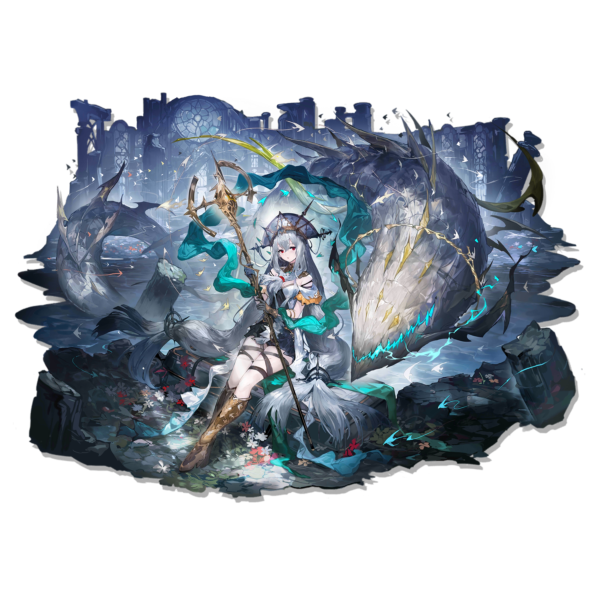</a>

  

<table align="center">
  <tr>
    <th align="center" colspan="2">
      
    </th>
  </tr>
  <tr>
    <td align="center">
      <a
        href="#----profile-information--"
      >
        Genshin Impact Stats</a
      >
    </td>
    <td align="center">
      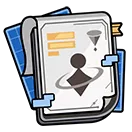<a
        href="#----profile-information---1"
      >
        Honkai: Star Rail Stats</a
      >
    </td>
  </tr>
  <tr>
    <td align="center">
      <a
        href="#----characters--"
      >
        Genshin Impact Characters</a
      >
    </td>
    <td align="center">
      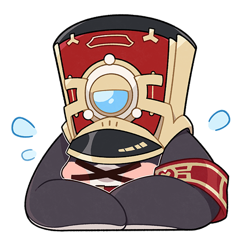<a
        href="#----characters---1"
      >
        Honkai: Star Rail Characters</a
      >
    </td>
  </tr>
  <tr>
    <th align="center" colspan="2">
      <a href="https://enka.network/u/juliusulee"> Enka.Network</a>
    </th>
  </tr>
</table>

  
  
  
  
  
   
  

  <b>Display GitHub Action Badge</b>
  

  <a
    href="https://github.com/Julius-Ulee/King-Genshin-StarRail-Stats/blob/master/README.md"
    >Readme</a
  >
  •
  <a
    href="https://github.com/Julius-Ulee/King-Genshin-StarRail-Stats/blob/master/docs/README_INFO.md"
    >Readme Info</a
  >
  •
  <a
    href="https://github.com/Julius-Ulee/King-Genshin-StarRail-Stats/blob/master/.gitignore"
    >Gitignore</a
  >
  •
  <a
    href="https://github.com/Julius-Ulee/King-Genshin-StarRail-Stats/blob/master/requirements.txt"
    >Requirements</a
  >
  •
  <a
    href="https://github.com/Julius-Ulee/King-Genshin-StarRail-Stats/blob/master/main.py"
    >main.py</a
  >
  •
  <a
    href="https://github.com/Julius-Ulee/King-Genshin-StarRail-Stats/blob/master/files/redeemed_genshin_codes.txt"
    >Codes Genshin</a
  >
  •
  <a
    href="https://github.com/Julius-Ulee/King-Genshin-StarRail-Stats/blob/master/files/redeemed_starrail_codes.txt"
    >Codes StarRail</a
  >

<h3 align="center">
  🕒 Updated at <u>Apr 04, 2025 19:35 +0700</u> (🤖Automated)
</h3>

  

  

 

  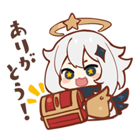

<h2 align="center">
  
  Profile Information
  
</h2>
<table align="center">
  <tr>
    <th rowspan="2" align="center">
      
    </th>
    <td colspan="2" align="center">
      
      <b>魈•zhang</b> <code>Lv. 58</code>
    </td>
  </tr>
  <tr>
    <td align="center"><b>Asia Server</b></td>
    <td align="center"><b>UID Hide</b></td>
  </tr>
</table>

<h2 align="center">
   Daily Rewards Genshin
  Impact 
</h2>
<table align="center">
  <tr>
    <td align="center"><b>Total Rewards Claimed:</b> <code>4</code></td>
  </tr>
  <tr>
    <td align="center">
      <b>Last Claimed Reward:</b> <a
        href="https://act.hoyolab.com/ys/event/signin-sea-v3/index.html?act_id=e202102251931481"
        ></a
      > 
      <b>20 x Primogem</b>
    </td>
  </tr>
  <tr>
    <td align="center"><b>Last Checked: 🕒 2025-04-04 09:21:25+08:00</b></td>
  </tr>
</table>

<h2 align="center">
  
  Stats
  
</h2>
<table align="center">
  <tr>
    <td>
      
      Achievements
    </td>
    <td align="center"><b>601</b></td>
  </tr>
  <tr>
    <td>
      
      Days Active
    </td>
    <td align="center"><b>490</b></td>
  </tr>
  <tr>
    <td>
      
      Characters
    </td>
    <td align="center"><b>51</b></td>
  </tr>
  <tr>
    <td>
       Waypoints Unlocked
    </td>
    <td align="center"><b>406</b></td>
  </tr>
  <tr>
    <td>
      
      Anemoculus
    </td>
    <td align="center"><b>66</b></td>
  </tr>
  <tr>
    <td>
      
      Geoculus
    </td>
    <td align="center"><b>131</b></td>
  </tr>
  <tr>
    <td>
       Electroculus
    </td>
    <td align="center"><b>181</b></td>
  </tr>
  <tr>
    <td>
      
      Dendroculus
    </td>
    <td align="center"><b>58</b></td>
  </tr>
  <tr>
    <td>
      
      Hydroculus
    </td>
    <td align="center"><b>11</b></td>
  </tr>
  <tr>
    <td>
      
      Pyroculus
    </td>
    <td align="center"><b>1</b></td>
  </tr>
  <tr>
    <td>
       Common Chests
      Opened
    </td>
    <td align="center"><b>1508</b></td>
  </tr>
  <tr>
    <td>
      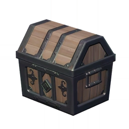 Exquisite
      Chests Opened
    </td>
    <td align="center"><b>1104</b></td>
  </tr>
  <tr>
    <td>
      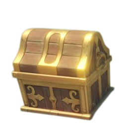 Precious Chests
      Opened
    </td>
    <td align="center"><b>312</b></td>
  </tr>
  <tr>
    <td>
      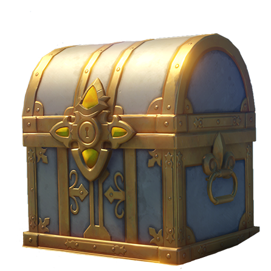 Luxurious
      Chests Opened
    </td>
    <td align="center"><b>116</b></td>
  </tr>
  <tr>
    <td>
      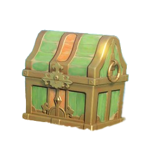 Remarkable Chests
      Opened
    </td>
    <td align="center"><b>57</b></td>
  </tr>
  <tr>
    <td>
       Domains Unlocked
    </td>
    <td align="center"><b>48</b></td>
  </tr>
  <tr>
    <td>
       Spiral Abyss
    </td>
    <td align="center"><b>9-3</b></td>
  </tr>
  <tr>
    <td>
      
      Max Friendship Characters
    </td>
    <td align="center"><b>10</b></td>
  </tr>
</table>

<h2 align="center">
  
  Exploration
  
</h2>
<table align="center">
  <tr>
    <th>
      
      Chenyu Vale: Upper Vale
    </th>
    <th>
      
      Chenyu Vale: Southern Mountain
    </th>
    <th>
      
      Mt. Laixin
    </th>
    <th>
      
      Fontaine
    </th>
    <th>
      
      Sumeru
    </th>
    <th>
      
      The Chasm: Underground Mines
    </th>
    <th>
      
      The Chasm
    </th>
    <th>
      
      Enkanomiya
    </th>
    <th>
      
      Inazuma
    </th>
    <th>
      
      Dragonspine
    </th>
    <th>
      
      Liyue
    </th>
    <th>
      
      Mondstadt
    </th>
    <th>
      
      Natlan
    </th>
    <th>
      
      Chenyu Vale
    </th>
  </tr>
  <tr>
    <td>
      

        
      

    </td>
    <td>
      

        
      

    </td>
    <td>
      

        
      

    </td>
    <td>
      

        
      

    </td>
    <td>
      

        
      

    </td>
    <td>
      

        
      

    </td>
    <td>
      

        
      

    </td>
    <td>
      

        
      

    </td>
    <td>
      

        
      

    </td>
    <td>
      

        
      

    </td>
    <td>
      

        
      

    </td>
    <td>
      

        
      

    </td>
    <td>
      

        
      

    </td>
    <td>
      

        
      

    </td>
  </tr>
  <tr>
    <td>
      <table>
        <tr>
          <td>Explored</td>
          <td>
            
          </td>
        </tr>
        <tr>
          <td>TypeUnknow</td>
          <td align="center">0</td>
        </tr>
      </table>
    </td>
    <td>
      <table>
        <tr>
          <td>Explored</td>
          <td>
            
          </td>
        </tr>
        <tr>
          <td>TypeUnknow</td>
          <td align="center">0</td>
        </tr>
      </table>
    </td>
    <td>
      <table>
        <tr>
          <td>Explored</td>
          <td>
            
          </td>
        </tr>
        <tr>
          <td>TypeUnknow</td>
          <td align="center">0</td>
        </tr>
      </table>
    </td>
    <td>
      <table>
        <tr>
          <td>Explored</td>
          <td>
            
          </td>
        </tr>
        <tr>
          <td>Reputation</td>
          <td align="center">1</td>
        </tr>
      </table>
    </td>
    <td>
      <table>
        <tr>
          <td>Explored</td>
          <td>
            
          </td>
        </tr>
        <tr>
          <td>Reputation</td>
          <td align="center">10</td>
        </tr>
      </table>
    </td>
    <td>
      <table>
        <tr>
          <td>Explored</td>
          <td>
            
          </td>
        </tr>
        <tr>
          <td>Offering</td>
          <td align="center">10</td>
        </tr>
      </table>
    </td>
    <td>
      <table>
        <tr>
          <td>Explored</td>
          <td>
            
          </td>
        </tr>
        <tr>
          <td>Offering</td>
          <td align="center">10</td>
        </tr>
      </table>
    </td>
    <td>
      <table>
        <tr>
          <td>Explored</td>
          <td>
            
          </td>
        </tr>
        <tr>
          <td>Offering</td>
          <td align="center">0</td>
        </tr>
      </table>
    </td>
    <td>
      <table>
        <tr>
          <td>Explored</td>
          <td>
            
          </td>
        </tr>
        <tr>
          <td>Reputation</td>
          <td align="center">10</td>
        </tr>
      </table>
    </td>
    <td>
      <table>
        <tr>
          <td>Explored</td>
          <td>
            
          </td>
        </tr>
        <tr>
          <td>Offering</td>
          <td align="center">12</td>
        </tr>
      </table>
    </td>
    <td>
      <table>
        <tr>
          <td>Explored</td>
          <td>
            
          </td>
        </tr>
        <tr>
          <td>Reputation</td>
          <td align="center">8</td>
        </tr>
      </table>
    </td>
    <td>
      <table>
        <tr>
          <td>Explored</td>
          <td>
            
          </td>
        </tr>
        <tr>
          <td>Reputation</td>
          <td align="center">8</td>
        </tr>
      </table>
    </td>
    <td>
      <table>
        <tr>
          <td>Explored</td>
          <td>
            
          </td>
        </tr>
        <tr>
          <td>Reputation</td>
          <td align="center">0</td>
        </tr>
      </table>
    </td>
    <td>
      <table>
        <tr>
          <td>Explored</td>
          <td>
            
          </td>
        </tr>
        <tr>
          <td>Offering</td>
          <td align="center">0</td>
        </tr>
      </table>
    </td>
  </tr>
</table>
<h2 align="center">
  
  Serenitea Pot
  
</h2>
<table align="center">
  <tr>
    <td colspan="2" align="center">
       
      <b>Stately</b>
    </td>
  </tr>
  <tr>
    <td>
      
      <b>Highest Adeptal Energy</b>
    </td>
    <td align="center"><code>12490</code></td>
  </tr>
  <tr>
    <td>
      
      <b>Total Furnishings Obtained</b>
    </td>
    <td align="center"><code>652</code></td>
  </tr>
  <tr>
    <td>
      
      <b>Trust Rank</b>
    </td>
    <td align="center"><code>8</code></td>
  </tr>
  <tr>
    <td>
      
      <b>Visitor History</b>
    </td>
    <td align="center"><code>1</code></td>
  </tr>
</table>
<h2 align="center">
   Diary
  
</h2>
<table align="center">
  <tr>
    <td align="center">
      
      Primogems earned
    </td>
    <td align="center"><b>0</b> <code>(rate -100)</code></td>
  </tr>
  <tr>
    <td align="center">
      
      Mora earned
    </td>
    <td align="center"><b>0</b> <code>(rate -100)</code></td>
  </tr>
  <tr>
    <td align="center">
      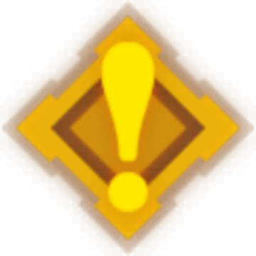 Categories
    </td>
    <td>
      Events: <b>0</b> <code>(0%)</code> Daily Activity: <b>0</b>
      <code>(0%)</code> Spiral Abyss: <b>0</b> <code>(0%)</code
      > Imaginarium Theater: <b>0</b> <code>(0%)</code> Quests:
      <b>0</b> <code>(0%)</code> Adventure: <b>0</b> <code>(0%)</code
      > Mail: <b>0</b> <code>(0%)</code> Other: <b>0</b>
      <code>(0%)</code> 
    </td>
  </tr>
</table>

  

<h2 align="center">
  
  Characters
  
</h2>

  

    <b> Arlecchino</b>
  

   
  <table align="center">
    <tr>
      <th>
        <h3 align="center">
          
          Arlecchino
        </h3>
      </th>
      <th>
        <h3 align="center">
          
          Crimson Moon's Semblance
        </h3>
      </th>
    </tr>
    <tr>
      <td>
        

          
        

      </td>
      <td>
        

          
        

      </td>
    </tr>
    <tr>
      <td>
        <table align="center">
          <tr>
            <td>Rarity</td>
            <td align="center">⭐⭐⭐⭐⭐</td>
          </tr>
          <tr>
            <td>Element</td>
            <td align="center">
              
              Pyro
            </td>
          </tr>
          <tr>
            <td>Level</td>
            <td align="center"><code>+90</code></td>
          </tr>
          <tr>
            <td>Friendship</td>
            <td align="center"><code>+9</code></td>
          </tr>
          <tr>
            <td>Constellation</td>
            <td align="center"><code>0</code></td>
          </tr>
          <tr>
            <td>Artifacts </td>
            <td align="center"></td>
          </tr>
          <tr>
            <td>Outfits</td>
            <td align="center"></td>
          </tr>
        </table>
      </td>
      <td valign="top">
        <table align="center">
          <tr>
            <td>Name</td>
            <td align="center">Crimson Moon's Semblance</td>
          </tr>
          <tr>
            <td>Rarity</td>
            <td align="center">⭐⭐⭐⭐⭐</td>
          </tr>
          <tr>
            <td>Level</td>
            <td align="center"><code>+90</code></td>
          </tr>
          <tr>
            <td>Refinement</td>
            <td align="center"><code>1</code></td>
          </tr>
        </table>
      </td>
    </tr>
  </table>

  

    <b> Navia</b>
  

   
  <table align="center">
    <tr>
      <th>
        <h3 align="center">
          
          Navia
        </h3>
      </th>
      <th>
        <h3 align="center">
          
          Beacon of the Reed Sea
        </h3>
      </th>
    </tr>
    <tr>
      <td>
        

          
        

      </td>
      <td>
        

          
        

      </td>
    </tr>
    <tr>
      <td>
        <table align="center">
          <tr>
            <td>Rarity</td>
            <td align="center">⭐⭐⭐⭐⭐</td>
          </tr>
          <tr>
            <td>Element</td>
            <td align="center">
              
              Geo
            </td>
          </tr>
          <tr>
            <td>Level</td>
            <td align="center"><code>+90</code></td>
          </tr>
          <tr>
            <td>Friendship</td>
            <td align="center"><code>+10</code></td>
          </tr>
          <tr>
            <td>Constellation</td>
            <td align="center"><code>0</code></td>
          </tr>
          <tr>
            <td>Artifacts </td>
            <td align="center"></td>
          </tr>
          <tr>
            <td>Outfits</td>
            <td align="center"></td>
          </tr>
        </table>
      </td>
      <td valign="top">
        <table align="center">
          <tr>
            <td>Name</td>
            <td align="center">Beacon of the Reed Sea</td>
          </tr>
          <tr>
            <td>Rarity</td>
            <td align="center">⭐⭐⭐⭐⭐</td>
          </tr>
          <tr>
            <td>Level</td>
            <td align="center"><code>+90</code></td>
          </tr>
          <tr>
            <td>Refinement</td>
            <td align="center"><code>1</code></td>
          </tr>
        </table>
      </td>
    </tr>
  </table>

  

    <b> Nahida</b>
  

   
  <table align="center">
    <tr>
      <th>
        <h3 align="center">
          
          Nahida
        </h3>
      </th>
      <th>
        <h3 align="center">
          
          Sacrificial Fragments
        </h3>
      </th>
    </tr>
    <tr>
      <td>
        

          
        

      </td>
      <td>
        

          
        

      </td>
    </tr>
    <tr>
      <td>
        <table align="center">
          <tr>
            <td>Rarity</td>
            <td align="center">⭐⭐⭐⭐⭐</td>
          </tr>
          <tr>
            <td>Element</td>
            <td align="center">
              
              Dendro
            </td>
          </tr>
          <tr>
            <td>Level</td>
            <td align="center"><code>+90</code></td>
          </tr>
          <tr>
            <td>Friendship</td>
            <td align="center"><code>+10</code></td>
          </tr>
          <tr>
            <td>Constellation</td>
            <td align="center"><code>0</code></td>
          </tr>
          <tr>
            <td>Artifacts </td>
            <td align="center"></td>
          </tr>
          <tr>
            <td>Outfits</td>
            <td align="center"></td>
          </tr>
        </table>
      </td>
      <td valign="top">
        <table align="center">
          <tr>
            <td>Name</td>
            <td align="center">Sacrificial Fragments</td>
          </tr>
          <tr>
            <td>Rarity</td>
            <td align="center">⭐⭐⭐⭐</td>
          </tr>
          <tr>
            <td>Level</td>
            <td align="center"><code>+90</code></td>
          </tr>
          <tr>
            <td>Refinement</td>
            <td align="center"><code>1</code></td>
          </tr>
        </table>
      </td>
    </tr>
  </table>

  

    <b> Cyno</b>
  

   
  <table align="center">
    <tr>
      <th>
        <h3 align="center">
          
          Cyno
        </h3>
      </th>
      <th>
        <h3 align="center">
          
          White Tassel
        </h3>
      </th>
    </tr>
    <tr>
      <td>
        

          
        

      </td>
      <td>
        

          
        

      </td>
    </tr>
    <tr>
      <td>
        <table align="center">
          <tr>
            <td>Rarity</td>
            <td align="center">⭐⭐⭐⭐⭐</td>
          </tr>
          <tr>
            <td>Element</td>
            <td align="center">
              
              Electro
            </td>
          </tr>
          <tr>
            <td>Level</td>
            <td align="center"><code>+90</code></td>
          </tr>
          <tr>
            <td>Friendship</td>
            <td align="center"><code>+10</code></td>
          </tr>
          <tr>
            <td>Constellation</td>
            <td align="center"><code>0</code></td>
          </tr>
          <tr>
            <td>Artifacts </td>
            <td align="center"></td>
          </tr>
          <tr>
            <td>Outfits</td>
            <td align="center"></td>
          </tr>
        </table>
      </td>
      <td valign="top">
        <table align="center">
          <tr>
            <td>Name</td>
            <td align="center">White Tassel</td>
          </tr>
          <tr>
            <td>Rarity</td>
            <td align="center">⭐⭐⭐</td>
          </tr>
          <tr>
            <td>Level</td>
            <td align="center"><code>+90</code></td>
          </tr>
          <tr>
            <td>Refinement</td>
            <td align="center"><code>5</code></td>
          </tr>
        </table>
      </td>
    </tr>
  </table>

  

    <b> Sangonomiya Kokomi</b>
  

   
  <table align="center">
    <tr>
      <th>
        <h3 align="center">
          
          Sangonomiya Kokomi
        </h3>
      </th>
      <th>
        <h3 align="center">
          
          Hakushin Ring
        </h3>
      </th>
    </tr>
    <tr>
      <td>
        

          
        

      </td>
      <td>
        

          
        

      </td>
    </tr>
    <tr>
      <td>
        <table align="center">
          <tr>
            <td>Rarity</td>
            <td align="center">⭐⭐⭐⭐⭐</td>
          </tr>
          <tr>
            <td>Element</td>
            <td align="center">
              
              Hydro
            </td>
          </tr>
          <tr>
            <td>Level</td>
            <td align="center"><code>+90</code></td>
          </tr>
          <tr>
            <td>Friendship</td>
            <td align="center"><code>+9</code></td>
          </tr>
          <tr>
            <td>Constellation</td>
            <td align="center"><code>0</code></td>
          </tr>
          <tr>
            <td>Artifacts </td>
            <td align="center"></td>
          </tr>
          <tr>
            <td>Outfits</td>
            <td align="center"></td>
          </tr>
        </table>
      </td>
      <td valign="top">
        <table align="center">
          <tr>
            <td>Name</td>
            <td align="center">Hakushin Ring</td>
          </tr>
          <tr>
            <td>Rarity</td>
            <td align="center">⭐⭐⭐⭐</td>
          </tr>
          <tr>
            <td>Level</td>
            <td align="center"><code>+90</code></td>
          </tr>
          <tr>
            <td>Refinement</td>
            <td align="center"><code>1</code></td>
          </tr>
        </table>
      </td>
    </tr>
  </table>

  

    <b> Zhongli</b>
  

   
  <table align="center">
    <tr>
      <th>
        <h3 align="center">
          
          Zhongli
        </h3>
      </th>
      <th>
        <h3 align="center">
          
          Favonius Lance
        </h3>
      </th>
    </tr>
    <tr>
      <td>
        

          
        

      </td>
      <td>
        

          
        

      </td>
    </tr>
    <tr>
      <td>
        <table align="center">
          <tr>
            <td>Rarity</td>
            <td align="center">⭐⭐⭐⭐⭐</td>
          </tr>
          <tr>
            <td>Element</td>
            <td align="center">
              
              Geo
            </td>
          </tr>
          <tr>
            <td>Level</td>
            <td align="center"><code>+90</code></td>
          </tr>
          <tr>
            <td>Friendship</td>
            <td align="center"><code>+10</code></td>
          </tr>
          <tr>
            <td>Constellation</td>
            <td align="center"><code>0</code></td>
          </tr>
          <tr>
            <td>Artifacts </td>
            <td align="center"></td>
          </tr>
          <tr>
            <td>Outfits</td>
            <td align="center"></td>
          </tr>
        </table>
      </td>
      <td valign="top">
        <table align="center">
          <tr>
            <td>Name</td>
            <td align="center">Favonius Lance</td>
          </tr>
          <tr>
            <td>Rarity</td>
            <td align="center">⭐⭐⭐⭐</td>
          </tr>
          <tr>
            <td>Level</td>
            <td align="center"><code>+90</code></td>
          </tr>
          <tr>
            <td>Refinement</td>
            <td align="center"><code>5</code></td>
          </tr>
        </table>
      </td>
    </tr>
  </table>

  

    <b> Diluc</b>
  

   
  <table align="center">
    <tr>
      <th>
        <h3 align="center">
          
          Diluc
        </h3>
      </th>
      <th>
        <h3 align="center">
          
          Blackcliff Slasher
        </h3>
      </th>
    </tr>
    <tr>
      <td>
        

          
        

      </td>
      <td>
        

          
        

      </td>
    </tr>
    <tr>
      <td>
        <table align="center">
          <tr>
            <td>Rarity</td>
            <td align="center">⭐⭐⭐⭐⭐</td>
          </tr>
          <tr>
            <td>Element</td>
            <td align="center">
              
              Pyro
            </td>
          </tr>
          <tr>
            <td>Level</td>
            <td align="center"><code>+90</code></td>
          </tr>
          <tr>
            <td>Friendship</td>
            <td align="center"><code>+10</code></td>
          </tr>
          <tr>
            <td>Constellation</td>
            <td align="center"><code>2</code></td>
          </tr>
          <tr>
            <td>Artifacts </td>
            <td align="center"></td>
          </tr>
          <tr>
            <td>Outfits</td>
            <td align="center"></td>
          </tr>
        </table>
      </td>
      <td valign="top">
        <table align="center">
          <tr>
            <td>Name</td>
            <td align="center">Blackcliff Slasher</td>
          </tr>
          <tr>
            <td>Rarity</td>
            <td align="center">⭐⭐⭐⭐</td>
          </tr>
          <tr>
            <td>Level</td>
            <td align="center"><code>+90</code></td>
          </tr>
          <tr>
            <td>Refinement</td>
            <td align="center"><code>1</code></td>
          </tr>
        </table>
      </td>
    </tr>
  </table>

  

    <b> Traveler</b>
  

   
  <table align="center">
    <tr>
      <th>
        <h3 align="center">
          
          Traveler
        </h3>
      </th>
      <th>
        <h3 align="center">
          
          Prototype Rancour
        </h3>
      </th>
    </tr>
    <tr>
      <td>
        

          
        

      </td>
      <td>
        

          
        

      </td>
    </tr>
    <tr>
      <td>
        <table align="center">
          <tr>
            <td>Rarity</td>
            <td align="center">⭐⭐⭐⭐⭐</td>
          </tr>
          <tr>
            <td>Element</td>
            <td align="center">
              
              Geo
            </td>
          </tr>
          <tr>
            <td>Level</td>
            <td align="center"><code>+90</code></td>
          </tr>
          <tr>
            <td>Friendship</td>
            <td align="center"><code>+0</code></td>
          </tr>
          <tr>
            <td>Constellation</td>
            <td align="center"><code>6</code></td>
          </tr>
          <tr>
            <td>Artifacts </td>
            <td align="center"></td>
          </tr>
          <tr>
            <td>Outfits</td>
            <td align="center"></td>
          </tr>
        </table>
      </td>
      <td valign="top">
        <table align="center">
          <tr>
            <td>Name</td>
            <td align="center">Prototype Rancour</td>
          </tr>
          <tr>
            <td>Rarity</td>
            <td align="center">⭐⭐⭐⭐</td>
          </tr>
          <tr>
            <td>Level</td>
            <td align="center"><code>+90</code></td>
          </tr>
          <tr>
            <td>Refinement</td>
            <td align="center"><code>1</code></td>
          </tr>
        </table>
      </td>
    </tr>
  </table>

  

    <b> Sucrose</b>
  

   
  <table align="center">
    <tr>
      <th>
        <h3 align="center">
          
          Sucrose
        </h3>
      </th>
      <th>
        <h3 align="center">
          
          Sacrificial Fragments
        </h3>
      </th>
    </tr>
    <tr>
      <td>
        

          
        

      </td>
      <td>
        

          
        

      </td>
    </tr>
    <tr>
      <td>
        <table align="center">
          <tr>
            <td>Rarity</td>
            <td align="center">⭐⭐⭐⭐</td>
          </tr>
          <tr>
            <td>Element</td>
            <td align="center">
              
              Anemo
            </td>
          </tr>
          <tr>
            <td>Level</td>
            <td align="center"><code>+90</code></td>
          </tr>
          <tr>
            <td>Friendship</td>
            <td align="center"><code>+10</code></td>
          </tr>
          <tr>
            <td>Constellation</td>
            <td align="center"><code>2</code></td>
          </tr>
          <tr>
            <td>Artifacts </td>
            <td align="center"></td>
          </tr>
          <tr>
            <td>Outfits</td>
            <td align="center"></td>
          </tr>
        </table>
      </td>
      <td valign="top">
        <table align="center">
          <tr>
            <td>Name</td>
            <td align="center">Sacrificial Fragments</td>
          </tr>
          <tr>
            <td>Rarity</td>
            <td align="center">⭐⭐⭐⭐</td>
          </tr>
          <tr>
            <td>Level</td>
            <td align="center"><code>+20</code></td>
          </tr>
          <tr>
            <td>Refinement</td>
            <td align="center"><code>2</code></td>
          </tr>
        </table>
      </td>
    </tr>
  </table>

  

    <b> Bennett</b>
  

   
  <table align="center">
    <tr>
      <th>
        <h3 align="center">
          
          Bennett
        </h3>
      </th>
      <th>
        <h3 align="center">
          
          Lion's Roar
        </h3>
      </th>
    </tr>
    <tr>
      <td>
        

          
        

      </td>
      <td>
        

          
        

      </td>
    </tr>
    <tr>
      <td>
        <table align="center">
          <tr>
            <td>Rarity</td>
            <td align="center">⭐⭐⭐⭐</td>
          </tr>
          <tr>
            <td>Element</td>
            <td align="center">
              
              Pyro
            </td>
          </tr>
          <tr>
            <td>Level</td>
            <td align="center"><code>+90</code></td>
          </tr>
          <tr>
            <td>Friendship</td>
            <td align="center"><code>+10</code></td>
          </tr>
          <tr>
            <td>Constellation</td>
            <td align="center"><code>4</code></td>
          </tr>
          <tr>
            <td>Artifacts </td>
            <td align="center"></td>
          </tr>
          <tr>
            <td>Outfits</td>
            <td align="center"></td>
          </tr>
        </table>
      </td>
      <td valign="top">
        <table align="center">
          <tr>
            <td>Name</td>
            <td align="center">Lion's Roar</td>
          </tr>
          <tr>
            <td>Rarity</td>
            <td align="center">⭐⭐⭐⭐</td>
          </tr>
          <tr>
            <td>Level</td>
            <td align="center"><code>+90</code></td>
          </tr>
          <tr>
            <td>Refinement</td>
            <td align="center"><code>5</code></td>
          </tr>
        </table>
      </td>
    </tr>
  </table>

  

    <b> Fischl</b>
  

   
  <table align="center">
    <tr>
      <th>
        <h3 align="center">
          
          Fischl
        </h3>
      </th>
      <th>
        <h3 align="center">
          
          Polar Star
        </h3>
      </th>
    </tr>
    <tr>
      <td>
        

          
        

      </td>
      <td>
        

          
        

      </td>
    </tr>
    <tr>
      <td>
        <table align="center">
          <tr>
            <td>Rarity</td>
            <td align="center">⭐⭐⭐⭐</td>
          </tr>
          <tr>
            <td>Element</td>
            <td align="center">
              
              Electro
            </td>
          </tr>
          <tr>
            <td>Level</td>
            <td align="center"><code>+90</code></td>
          </tr>
          <tr>
            <td>Friendship</td>
            <td align="center"><code>+7</code></td>
          </tr>
          <tr>
            <td>Constellation</td>
            <td align="center"><code>2</code></td>
          </tr>
          <tr>
            <td>Artifacts </td>
            <td align="center"></td>
          </tr>
          <tr>
            <td>Outfits</td>
            <td align="center"></td>
          </tr>
        </table>
      </td>
      <td valign="top">
        <table align="center">
          <tr>
            <td>Name</td>
            <td align="center">Polar Star</td>
          </tr>
          <tr>
            <td>Rarity</td>
            <td align="center">⭐⭐⭐⭐⭐</td>
          </tr>
          <tr>
            <td>Level</td>
            <td align="center"><code>+90</code></td>
          </tr>
          <tr>
            <td>Refinement</td>
            <td align="center"><code>2</code></td>
          </tr>
        </table>
      </td>
    </tr>
  </table>

  

    <b> Xingqiu</b>
  

   
  <table align="center">
    <tr>
      <th>
        <h3 align="center">
          
          Xingqiu
        </h3>
      </th>
      <th>
        <h3 align="center">
          
          Sacrificial Sword
        </h3>
      </th>
    </tr>
    <tr>
      <td>
        

          
        

      </td>
      <td>
        

          
        

      </td>
    </tr>
    <tr>
      <td>
        <table align="center">
          <tr>
            <td>Rarity</td>
            <td align="center">⭐⭐⭐⭐</td>
          </tr>
          <tr>
            <td>Element</td>
            <td align="center">
              
              Hydro
            </td>
          </tr>
          <tr>
            <td>Level</td>
            <td align="center"><code>+90</code></td>
          </tr>
          <tr>
            <td>Friendship</td>
            <td align="center"><code>+10</code></td>
          </tr>
          <tr>
            <td>Constellation</td>
            <td align="center"><code>2</code></td>
          </tr>
          <tr>
            <td>Artifacts </td>
            <td align="center"></td>
          </tr>
          <tr>
            <td>Outfits</td>
            <td align="center"></td>
          </tr>
        </table>
      </td>
      <td valign="top">
        <table align="center">
          <tr>
            <td>Name</td>
            <td align="center">Sacrificial Sword</td>
          </tr>
          <tr>
            <td>Rarity</td>
            <td align="center">⭐⭐⭐⭐</td>
          </tr>
          <tr>
            <td>Level</td>
            <td align="center"><code>+90</code></td>
          </tr>
          <tr>
            <td>Refinement</td>
            <td align="center"><code>1</code></td>
          </tr>
        </table>
      </td>
    </tr>
  </table>

  

    <b> Xiangling</b>
  

   
  <table align="center">
    <tr>
      <th>
        <h3 align="center">
          
          Xiangling
        </h3>
      </th>
      <th>
        <h3 align="center">
          
          "The Catch"
        </h3>
      </th>
    </tr>
    <tr>
      <td>
        

          
        

      </td>
      <td>
        

          
        

      </td>
    </tr>
    <tr>
      <td>
        <table align="center">
          <tr>
            <td>Rarity</td>
            <td align="center">⭐⭐⭐⭐</td>
          </tr>
          <tr>
            <td>Element</td>
            <td align="center">
              
              Pyro
            </td>
          </tr>
          <tr>
            <td>Level</td>
            <td align="center"><code>+90</code></td>
          </tr>
          <tr>
            <td>Friendship</td>
            <td align="center"><code>+10</code></td>
          </tr>
          <tr>
            <td>Constellation</td>
            <td align="center"><code>3</code></td>
          </tr>
          <tr>
            <td>Artifacts </td>
            <td align="center"></td>
          </tr>
          <tr>
            <td>Outfits</td>
            <td align="center"></td>
          </tr>
        </table>
      </td>
      <td valign="top">
        <table align="center">
          <tr>
            <td>Name</td>
            <td align="center">"The Catch"</td>
          </tr>
          <tr>
            <td>Rarity</td>
            <td align="center">⭐⭐⭐⭐</td>
          </tr>
          <tr>
            <td>Level</td>
            <td align="center"><code>+90</code></td>
          </tr>
          <tr>
            <td>Refinement</td>
            <td align="center"><code>5</code></td>
          </tr>
        </table>
      </td>
    </tr>
  </table>

  

    <b> Furina</b>
  

   
  <table align="center">
    <tr>
      <th>
        <h3 align="center">
          
          Furina
        </h3>
      </th>
      <th>
        <h3 align="center">
          
          Fleuve Cendre Ferryman
        </h3>
      </th>
    </tr>
    <tr>
      <td>
        

          
        

      </td>
      <td>
        

          
        

      </td>
    </tr>
    <tr>
      <td>
        <table align="center">
          <tr>
            <td>Rarity</td>
            <td align="center">⭐⭐⭐⭐⭐</td>
          </tr>
          <tr>
            <td>Element</td>
            <td align="center">
              
              Hydro
            </td>
          </tr>
          <tr>
            <td>Level</td>
            <td align="center"><code>+89</code></td>
          </tr>
          <tr>
            <td>Friendship</td>
            <td align="center"><code>+4</code></td>
          </tr>
          <tr>
            <td>Constellation</td>
            <td align="center"><code>0</code></td>
          </tr>
          <tr>
            <td>Artifacts </td>
            <td align="center"></td>
          </tr>
          <tr>
            <td>Outfits</td>
            <td align="center"></td>
          </tr>
        </table>
      </td>
      <td valign="top">
        <table align="center">
          <tr>
            <td>Name</td>
            <td align="center">Fleuve Cendre Ferryman</td>
          </tr>
          <tr>
            <td>Rarity</td>
            <td align="center">⭐⭐⭐⭐</td>
          </tr>
          <tr>
            <td>Level</td>
            <td align="center"><code>+90</code></td>
          </tr>
          <tr>
            <td>Refinement</td>
            <td align="center"><code>5</code></td>
          </tr>
        </table>
      </td>
    </tr>
  </table>

  

    <b> Keqing</b>
  

   
  <table align="center">
    <tr>
      <th>
        <h3 align="center">
          
          Keqing
        </h3>
      </th>
      <th>
        <h3 align="center">
          
          The Alley Flash
        </h3>
      </th>
    </tr>
    <tr>
      <td>
        

          
        

      </td>
      <td>
        

          
        

      </td>
    </tr>
    <tr>
      <td>
        <table align="center">
          <tr>
            <td>Rarity</td>
            <td align="center">⭐⭐⭐⭐⭐</td>
          </tr>
          <tr>
            <td>Element</td>
            <td align="center">
              
              Electro
            </td>
          </tr>
          <tr>
            <td>Level</td>
            <td align="center"><code>+60</code></td>
          </tr>
          <tr>
            <td>Friendship</td>
            <td align="center"><code>+3</code></td>
          </tr>
          <tr>
            <td>Constellation</td>
            <td align="center"><code>1</code></td>
          </tr>
          <tr>
            <td>Artifacts </td>
            <td align="center"></td>
          </tr>
          <tr>
            <td>Outfits</td>
            <td align="center"></td>
          </tr>
        </table>
      </td>
      <td valign="top">
        <table align="center">
          <tr>
            <td>Name</td>
            <td align="center">The Alley Flash</td>
          </tr>
          <tr>
            <td>Rarity</td>
            <td align="center">⭐⭐⭐⭐</td>
          </tr>
          <tr>
            <td>Level</td>
            <td align="center"><code>+20</code></td>
          </tr>
          <tr>
            <td>Refinement</td>
            <td align="center"><code>1</code></td>
          </tr>
        </table>
      </td>
    </tr>
  </table>

  

    <b> Kaeya</b>
  

   
  <table align="center">
    <tr>
      <th>
        <h3 align="center">
          
          Kaeya
        </h3>
      </th>
      <th>
        <h3 align="center">
          
          Favonius Sword
        </h3>
      </th>
    </tr>
    <tr>
      <td>
        

          
        

      </td>
      <td>
        

          
        

      </td>
    </tr>
    <tr>
      <td>
        <table align="center">
          <tr>
            <td>Rarity</td>
            <td align="center">⭐⭐⭐⭐</td>
          </tr>
          <tr>
            <td>Element</td>
            <td align="center">
              
              Cryo
            </td>
          </tr>
          <tr>
            <td>Level</td>
            <td align="center"><code>+60</code></td>
          </tr>
          <tr>
            <td>Friendship</td>
            <td align="center"><code>+4</code></td>
          </tr>
          <tr>
            <td>Constellation</td>
            <td align="center"><code>1</code></td>
          </tr>
          <tr>
            <td>Artifacts </td>
            <td align="center"></td>
          </tr>
          <tr>
            <td>Outfits</td>
            <td align="center"></td>
          </tr>
        </table>
      </td>
      <td valign="top">
        <table align="center">
          <tr>
            <td>Name</td>
            <td align="center">Favonius Sword</td>
          </tr>
          <tr>
            <td>Rarity</td>
            <td align="center">⭐⭐⭐⭐</td>
          </tr>
          <tr>
            <td>Level</td>
            <td align="center"><code>+70</code></td>
          </tr>
          <tr>
            <td>Refinement</td>
            <td align="center"><code>1</code></td>
          </tr>
        </table>
      </td>
    </tr>
  </table>

  

    <b> Mona</b>
  

   
  <table align="center">
    <tr>
      <th>
        <h3 align="center">
          
          Mona
        </h3>
      </th>
      <th>
        <h3 align="center">
          
          Favonius Codex
        </h3>
      </th>
    </tr>
    <tr>
      <td>
        

          
        

      </td>
      <td>
        

          
        

      </td>
    </tr>
    <tr>
      <td>
        <table align="center">
          <tr>
            <td>Rarity</td>
            <td align="center">⭐⭐⭐⭐⭐</td>
          </tr>
          <tr>
            <td>Element</td>
            <td align="center">
              
              Hydro
            </td>
          </tr>
          <tr>
            <td>Level</td>
            <td align="center"><code>+50</code></td>
          </tr>
          <tr>
            <td>Friendship</td>
            <td align="center"><code>+3</code></td>
          </tr>
          <tr>
            <td>Constellation</td>
            <td align="center"><code>0</code></td>
          </tr>
          <tr>
            <td>Artifacts </td>
            <td align="center"></td>
          </tr>
          <tr>
            <td>Outfits</td>
            <td align="center"></td>
          </tr>
        </table>
      </td>
      <td valign="top">
        <table align="center">
          <tr>
            <td>Name</td>
            <td align="center">Favonius Codex</td>
          </tr>
          <tr>
            <td>Rarity</td>
            <td align="center">⭐⭐⭐⭐</td>
          </tr>
          <tr>
            <td>Level</td>
            <td align="center"><code>+60</code></td>
          </tr>
          <tr>
            <td>Refinement</td>
            <td align="center"><code>1</code></td>
          </tr>
        </table>
      </td>
    </tr>
  </table>

  

    <b> Qiqi</b>
  

   
  <table align="center">
    <tr>
      <th>
        <h3 align="center">
          
          Qiqi
        </h3>
      </th>
      <th>
        <h3 align="center">
          
          Dull Blade
        </h3>
      </th>
    </tr>
    <tr>
      <td>
        

          
        

      </td>
      <td>
        

          
        

      </td>
    </tr>
    <tr>
      <td>
        <table align="center">
          <tr>
            <td>Rarity</td>
            <td align="center">⭐⭐⭐⭐⭐</td>
          </tr>
          <tr>
            <td>Element</td>
            <td align="center">
              
              Cryo
            </td>
          </tr>
          <tr>
            <td>Level</td>
            <td align="center"><code>+50</code></td>
          </tr>
          <tr>
            <td>Friendship</td>
            <td align="center"><code>+1</code></td>
          </tr>
          <tr>
            <td>Constellation</td>
            <td align="center"><code>0</code></td>
          </tr>
          <tr>
            <td>Artifacts </td>
            <td align="center"></td>
          </tr>
          <tr>
            <td>Outfits</td>
            <td align="center"></td>
          </tr>
        </table>
      </td>
      <td valign="top">
        <table align="center">
          <tr>
            <td>Name</td>
            <td align="center">Dull Blade</td>
          </tr>
          <tr>
            <td>Rarity</td>
            <td align="center">⭐</td>
          </tr>
          <tr>
            <td>Level</td>
            <td align="center"><code>+1</code></td>
          </tr>
          <tr>
            <td>Refinement</td>
            <td align="center"><code>1</code></td>
          </tr>
        </table>
      </td>
    </tr>
  </table>

  

    <b> Jean</b>
  

   
  <table align="center">
    <tr>
      <th>
        <h3 align="center">
          
          Jean
        </h3>
      </th>
      <th>
        <h3 align="center">
          
          Iron Sting
        </h3>
      </th>
    </tr>
    <tr>
      <td>
        

          
        

      </td>
      <td>
        

          
        

      </td>
    </tr>
    <tr>
      <td>
        <table align="center">
          <tr>
            <td>Rarity</td>
            <td align="center">⭐⭐⭐⭐⭐</td>
          </tr>
          <tr>
            <td>Element</td>
            <td align="center">
              
              Anemo
            </td>
          </tr>
          <tr>
            <td>Level</td>
            <td align="center"><code>+50</code></td>
          </tr>
          <tr>
            <td>Friendship</td>
            <td align="center"><code>+7</code></td>
          </tr>
          <tr>
            <td>Constellation</td>
            <td align="center"><code>0</code></td>
          </tr>
          <tr>
            <td>Artifacts </td>
            <td align="center"></td>
          </tr>
          <tr>
            <td>Outfits</td>
            <td align="center"></td>
          </tr>
        </table>
      </td>
      <td valign="top">
        <table align="center">
          <tr>
            <td>Name</td>
            <td align="center">Iron Sting</td>
          </tr>
          <tr>
            <td>Rarity</td>
            <td align="center">⭐⭐⭐⭐</td>
          </tr>
          <tr>
            <td>Level</td>
            <td align="center"><code>+20</code></td>
          </tr>
          <tr>
            <td>Refinement</td>
            <td align="center"><code>1</code></td>
          </tr>
        </table>
      </td>
    </tr>
  </table>

  

    <b> Yaoyao</b>
  

   
  <table align="center">
    <tr>
      <th>
        <h3 align="center">
          
          Yaoyao
        </h3>
      </th>
      <th>
        <h3 align="center">
          
          Prototype Starglitter
        </h3>
      </th>
    </tr>
    <tr>
      <td>
        

          
        

      </td>
      <td>
        

          
        

      </td>
    </tr>
    <tr>
      <td>
        <table align="center">
          <tr>
            <td>Rarity</td>
            <td align="center">⭐⭐⭐⭐</td>
          </tr>
          <tr>
            <td>Element</td>
            <td align="center">
              
              Dendro
            </td>
          </tr>
          <tr>
            <td>Level</td>
            <td align="center"><code>+50</code></td>
          </tr>
          <tr>
            <td>Friendship</td>
            <td align="center"><code>+10</code></td>
          </tr>
          <tr>
            <td>Constellation</td>
            <td align="center"><code>1</code></td>
          </tr>
          <tr>
            <td>Artifacts </td>
            <td align="center"></td>
          </tr>
          <tr>
            <td>Outfits</td>
            <td align="center"></td>
          </tr>
        </table>
      </td>
      <td valign="top">
        <table align="center">
          <tr>
            <td>Name</td>
            <td align="center">Prototype Starglitter</td>
          </tr>
          <tr>
            <td>Rarity</td>
            <td align="center">⭐⭐⭐⭐</td>
          </tr>
          <tr>
            <td>Level</td>
            <td align="center"><code>+20</code></td>
          </tr>
          <tr>
            <td>Refinement</td>
            <td align="center"><code>1</code></td>
          </tr>
        </table>
      </td>
    </tr>
  </table>

  

    <b> Chongyun</b>
  

   
  <table align="center">
    <tr>
      <th>
        <h3 align="center">
          
          Chongyun
        </h3>
      </th>
      <th>
        <h3 align="center">
          
          Snow-Tombed Starsilver
        </h3>
      </th>
    </tr>
    <tr>
      <td>
        

          
        

      </td>
      <td>
        

          
        

      </td>
    </tr>
    <tr>
      <td>
        <table align="center">
          <tr>
            <td>Rarity</td>
            <td align="center">⭐⭐⭐⭐</td>
          </tr>
          <tr>
            <td>Element</td>
            <td align="center">
              
              Cryo
            </td>
          </tr>
          <tr>
            <td>Level</td>
            <td align="center"><code>+50</code></td>
          </tr>
          <tr>
            <td>Friendship</td>
            <td align="center"><code>+1</code></td>
          </tr>
          <tr>
            <td>Constellation</td>
            <td align="center"><code>0</code></td>
          </tr>
          <tr>
            <td>Artifacts </td>
            <td align="center"></td>
          </tr>
          <tr>
            <td>Outfits</td>
            <td align="center"></td>
          </tr>
        </table>
      </td>
      <td valign="top">
        <table align="center">
          <tr>
            <td>Name</td>
            <td align="center">Snow-Tombed Starsilver</td>
          </tr>
          <tr>
            <td>Rarity</td>
            <td align="center">⭐⭐⭐⭐</td>
          </tr>
          <tr>
            <td>Level</td>
            <td align="center"><code>+80</code></td>
          </tr>
          <tr>
            <td>Refinement</td>
            <td align="center"><code>2</code></td>
          </tr>
        </table>
      </td>
    </tr>
  </table>

  

    <b> Ningguang</b>
  

   
  <table align="center">
    <tr>
      <th>
        <h3 align="center">
          
          Ningguang
        </h3>
      </th>
      <th>
        <h3 align="center">
          
          Skyward Atlas
        </h3>
      </th>
    </tr>
    <tr>
      <td>
        

          
        

      </td>
      <td>
        

          
        

      </td>
    </tr>
    <tr>
      <td>
        <table align="center">
          <tr>
            <td>Rarity</td>
            <td align="center">⭐⭐⭐⭐</td>
          </tr>
          <tr>
            <td>Element</td>
            <td align="center">
              
              Geo
            </td>
          </tr>
          <tr>
            <td>Level</td>
            <td align="center"><code>+50</code></td>
          </tr>
          <tr>
            <td>Friendship</td>
            <td align="center"><code>+1</code></td>
          </tr>
          <tr>
            <td>Constellation</td>
            <td align="center"><code>1</code></td>
          </tr>
          <tr>
            <td>Artifacts </td>
            <td align="center"></td>
          </tr>
          <tr>
            <td>Outfits</td>
            <td align="center"></td>
          </tr>
        </table>
      </td>
      <td valign="top">
        <table align="center">
          <tr>
            <td>Name</td>
            <td align="center">Skyward Atlas</td>
          </tr>
          <tr>
            <td>Rarity</td>
            <td align="center">⭐⭐⭐⭐⭐</td>
          </tr>
          <tr>
            <td>Level</td>
            <td align="center"><code>+80</code></td>
          </tr>
          <tr>
            <td>Refinement</td>
            <td align="center"><code>1</code></td>
          </tr>
        </table>
      </td>
    </tr>
  </table>

  

    <b> Amber</b>
  

   
  <table align="center">
    <tr>
      <th>
        <h3 align="center">
          
          Amber
        </h3>
      </th>
      <th>
        <h3 align="center">
          
          Favonius Warbow
        </h3>
      </th>
    </tr>
    <tr>
      <td>
        

          
        

      </td>
      <td>
        

          
        

      </td>
    </tr>
    <tr>
      <td>
        <table align="center">
          <tr>
            <td>Rarity</td>
            <td align="center">⭐⭐⭐⭐</td>
          </tr>
          <tr>
            <td>Element</td>
            <td align="center">
              
              Pyro
            </td>
          </tr>
          <tr>
            <td>Level</td>
            <td align="center"><code>+50</code></td>
          </tr>
          <tr>
            <td>Friendship</td>
            <td align="center"><code>+3</code></td>
          </tr>
          <tr>
            <td>Constellation</td>
            <td align="center"><code>1</code></td>
          </tr>
          <tr>
            <td>Artifacts </td>
            <td align="center"></td>
          </tr>
          <tr>
            <td>Outfits</td>
            <td align="center"></td>
          </tr>
        </table>
      </td>
      <td valign="top">
        <table align="center">
          <tr>
            <td>Name</td>
            <td align="center">Favonius Warbow</td>
          </tr>
          <tr>
            <td>Rarity</td>
            <td align="center">⭐⭐⭐⭐</td>
          </tr>
          <tr>
            <td>Level</td>
            <td align="center"><code>+1</code></td>
          </tr>
          <tr>
            <td>Refinement</td>
            <td align="center"><code>1</code></td>
          </tr>
        </table>
      </td>
    </tr>
  </table>

  

    <b> Razor</b>
  

   
  <table align="center">
    <tr>
      <th>
        <h3 align="center">
          
          Razor
        </h3>
      </th>
      <th>
        <h3 align="center">
          
          Rainslasher
        </h3>
      </th>
    </tr>
    <tr>
      <td>
        

          
        

      </td>
      <td>
        

          
        

      </td>
    </tr>
    <tr>
      <td>
        <table align="center">
          <tr>
            <td>Rarity</td>
            <td align="center">⭐⭐⭐⭐</td>
          </tr>
          <tr>
            <td>Element</td>
            <td align="center">
              
              Electro
            </td>
          </tr>
          <tr>
            <td>Level</td>
            <td align="center"><code>+50</code></td>
          </tr>
          <tr>
            <td>Friendship</td>
            <td align="center"><code>+2</code></td>
          </tr>
          <tr>
            <td>Constellation</td>
            <td align="center"><code>1</code></td>
          </tr>
          <tr>
            <td>Artifacts </td>
            <td align="center"></td>
          </tr>
          <tr>
            <td>Outfits</td>
            <td align="center"></td>
          </tr>
        </table>
      </td>
      <td valign="top">
        <table align="center">
          <tr>
            <td>Name</td>
            <td align="center">Rainslasher</td>
          </tr>
          <tr>
            <td>Rarity</td>
            <td align="center">⭐⭐⭐⭐</td>
          </tr>
          <tr>
            <td>Level</td>
            <td align="center"><code>+60</code></td>
          </tr>
          <tr>
            <td>Refinement</td>
            <td align="center"><code>1</code></td>
          </tr>
        </table>
      </td>
    </tr>
  </table>

  

    <b> Barbara</b>
  

   
  <table align="center">
    <tr>
      <th>
        <h3 align="center">
          
          Barbara
        </h3>
      </th>
      <th>
        <h3 align="center">
          
          Emerald Orb
        </h3>
      </th>
    </tr>
    <tr>
      <td>
        

          
        

      </td>
      <td>
        

          
        

      </td>
    </tr>
    <tr>
      <td>
        <table align="center">
          <tr>
            <td>Rarity</td>
            <td align="center">⭐⭐⭐⭐</td>
          </tr>
          <tr>
            <td>Element</td>
            <td align="center">
              
              Hydro
            </td>
          </tr>
          <tr>
            <td>Level</td>
            <td align="center"><code>+50</code></td>
          </tr>
          <tr>
            <td>Friendship</td>
            <td align="center"><code>+3</code></td>
          </tr>
          <tr>
            <td>Constellation</td>
            <td align="center"><code>2</code></td>
          </tr>
          <tr>
            <td>Artifacts </td>
            <td align="center"></td>
          </tr>
          <tr>
            <td>Outfits</td>
            <td align="center"></td>
          </tr>
        </table>
      </td>
      <td valign="top">
        <table align="center">
          <tr>
            <td>Name</td>
            <td align="center">Emerald Orb</td>
          </tr>
          <tr>
            <td>Rarity</td>
            <td align="center">⭐⭐⭐</td>
          </tr>
          <tr>
            <td>Level</td>
            <td align="center"><code>+1</code></td>
          </tr>
          <tr>
            <td>Refinement</td>
            <td align="center"><code>1</code></td>
          </tr>
        </table>
      </td>
    </tr>
  </table>

  

    <b> Layla</b>
  

   
  <table align="center">
    <tr>
      <th>
        <h3 align="center">
          
          Layla
        </h3>
      </th>
      <th>
        <h3 align="center">
          
          Dark Iron Sword
        </h3>
      </th>
    </tr>
    <tr>
      <td>
        

          
        

      </td>
      <td>
        

          
        

      </td>
    </tr>
    <tr>
      <td>
        <table align="center">
          <tr>
            <td>Rarity</td>
            <td align="center">⭐⭐⭐⭐</td>
          </tr>
          <tr>
            <td>Element</td>
            <td align="center">
              
              Cryo
            </td>
          </tr>
          <tr>
            <td>Level</td>
            <td align="center"><code>+40</code></td>
          </tr>
          <tr>
            <td>Friendship</td>
            <td align="center"><code>+1</code></td>
          </tr>
          <tr>
            <td>Constellation</td>
            <td align="center"><code>1</code></td>
          </tr>
          <tr>
            <td>Artifacts </td>
            <td align="center"></td>
          </tr>
          <tr>
            <td>Outfits</td>
            <td align="center"></td>
          </tr>
        </table>
      </td>
      <td valign="top">
        <table align="center">
          <tr>
            <td>Name</td>
            <td align="center">Dark Iron Sword</td>
          </tr>
          <tr>
            <td>Rarity</td>
            <td align="center">⭐⭐⭐</td>
          </tr>
          <tr>
            <td>Level</td>
            <td align="center"><code>+1</code></td>
          </tr>
          <tr>
            <td>Refinement</td>
            <td align="center"><code>1</code></td>
          </tr>
        </table>
      </td>
    </tr>
  </table>

  

    <b> Collei</b>
  

   
  <table align="center">
    <tr>
      <th>
        <h3 align="center">
          
          Collei
        </h3>
      </th>
      <th>
        <h3 align="center">
          
          Messenger
        </h3>
      </th>
    </tr>
    <tr>
      <td>
        

          
        

      </td>
      <td>
        

          
        

      </td>
    </tr>
    <tr>
      <td>
        <table align="center">
          <tr>
            <td>Rarity</td>
            <td align="center">⭐⭐⭐⭐</td>
          </tr>
          <tr>
            <td>Element</td>
            <td align="center">
              
              Dendro
            </td>
          </tr>
          <tr>
            <td>Level</td>
            <td align="center"><code>+40</code></td>
          </tr>
          <tr>
            <td>Friendship</td>
            <td align="center"><code>+1</code></td>
          </tr>
          <tr>
            <td>Constellation</td>
            <td align="center"><code>2</code></td>
          </tr>
          <tr>
            <td>Artifacts </td>
            <td align="center"></td>
          </tr>
          <tr>
            <td>Outfits</td>
            <td align="center"></td>
          </tr>
        </table>
      </td>
      <td valign="top">
        <table align="center">
          <tr>
            <td>Name</td>
            <td align="center">Messenger</td>
          </tr>
          <tr>
            <td>Rarity</td>
            <td align="center">⭐⭐⭐</td>
          </tr>
          <tr>
            <td>Level</td>
            <td align="center"><code>+1</code></td>
          </tr>
          <tr>
            <td>Refinement</td>
            <td align="center"><code>1</code></td>
          </tr>
        </table>
      </td>
    </tr>
  </table>

  

    <b> Faruzan</b>
  

   
  <table align="center">
    <tr>
      <th>
        <h3 align="center">
          
          Faruzan
        </h3>
      </th>
      <th>
        <h3 align="center">
          
          Messenger
        </h3>
      </th>
    </tr>
    <tr>
      <td>
        

          
        

      </td>
      <td>
        

          
        

      </td>
    </tr>
    <tr>
      <td>
        <table align="center">
          <tr>
            <td>Rarity</td>
            <td align="center">⭐⭐⭐⭐</td>
          </tr>
          <tr>
            <td>Element</td>
            <td align="center">
              
              Anemo
            </td>
          </tr>
          <tr>
            <td>Level</td>
            <td align="center"><code>+24</code></td>
          </tr>
          <tr>
            <td>Friendship</td>
            <td align="center"><code>+1</code></td>
          </tr>
          <tr>
            <td>Constellation</td>
            <td align="center"><code>4</code></td>
          </tr>
          <tr>
            <td>Artifacts </td>
            <td align="center"></td>
          </tr>
          <tr>
            <td>Outfits</td>
            <td align="center"></td>
          </tr>
        </table>
      </td>
      <td valign="top">
        <table align="center">
          <tr>
            <td>Name</td>
            <td align="center">Messenger</td>
          </tr>
          <tr>
            <td>Rarity</td>
            <td align="center">⭐⭐⭐</td>
          </tr>
          <tr>
            <td>Level</td>
            <td align="center"><code>+1</code></td>
          </tr>
          <tr>
            <td>Refinement</td>
            <td align="center"><code>1</code></td>
          </tr>
        </table>
      </td>
    </tr>
  </table>

  

    <b> Dehya</b>
  

   
  <table align="center">
    <tr>
      <th>
        <h3 align="center">
          
          Dehya
        </h3>
      </th>
      <th>
        <h3 align="center">
          
          "Ultimate Overlord's Mega Magic Sword"
        </h3>
      </th>
    </tr>
    <tr>
      <td>
        

          
        

      </td>
      <td>
        

          
        

      </td>
    </tr>
    <tr>
      <td>
        <table align="center">
          <tr>
            <td>Rarity</td>
            <td align="center">⭐⭐⭐⭐⭐</td>
          </tr>
          <tr>
            <td>Element</td>
            <td align="center">
              
              Pyro
            </td>
          </tr>
          <tr>
            <td>Level</td>
            <td align="center"><code>+20</code></td>
          </tr>
          <tr>
            <td>Friendship</td>
            <td align="center"><code>+1</code></td>
          </tr>
          <tr>
            <td>Constellation</td>
            <td align="center"><code>0</code></td>
          </tr>
          <tr>
            <td>Artifacts </td>
            <td align="center"></td>
          </tr>
          <tr>
            <td>Outfits</td>
            <td align="center"></td>
          </tr>
        </table>
      </td>
      <td valign="top">
        <table align="center">
          <tr>
            <td>Name</td>
            <td align="center">"Ultimate Overlord's Mega Magic Sword"</td>
          </tr>
          <tr>
            <td>Rarity</td>
            <td align="center">⭐⭐⭐⭐</td>
          </tr>
          <tr>
            <td>Level</td>
            <td align="center"><code>+90</code></td>
          </tr>
          <tr>
            <td>Refinement</td>
            <td align="center"><code>5</code></td>
          </tr>
        </table>
      </td>
    </tr>
  </table>

  

    <b> Lynette</b>
  

   
  <table align="center">
    <tr>
      <th>
        <h3 align="center">
          
          Lynette
        </h3>
      </th>
      <th>
        <h3 align="center">
          
          Cool Steel
        </h3>
      </th>
    </tr>
    <tr>
      <td>
        

          
        

      </td>
      <td>
        

          
        

      </td>
    </tr>
    <tr>
      <td>
        <table align="center">
          <tr>
            <td>Rarity</td>
            <td align="center">⭐⭐⭐⭐</td>
          </tr>
          <tr>
            <td>Element</td>
            <td align="center">
              
              Anemo
            </td>
          </tr>
          <tr>
            <td>Level</td>
            <td align="center"><code>+20</code></td>
          </tr>
          <tr>
            <td>Friendship</td>
            <td align="center"><code>+1</code></td>
          </tr>
          <tr>
            <td>Constellation</td>
            <td align="center"><code>2</code></td>
          </tr>
          <tr>
            <td>Artifacts </td>
            <td align="center"></td>
          </tr>
          <tr>
            <td>Outfits</td>
            <td align="center"></td>
          </tr>
        </table>
      </td>
      <td valign="top">
        <table align="center">
          <tr>
            <td>Name</td>
            <td align="center">Cool Steel</td>
          </tr>
          <tr>
            <td>Rarity</td>
            <td align="center">⭐⭐⭐</td>
          </tr>
          <tr>
            <td>Level</td>
            <td align="center"><code>+1</code></td>
          </tr>
          <tr>
            <td>Refinement</td>
            <td align="center"><code>1</code></td>
          </tr>
        </table>
      </td>
    </tr>
  </table>

  

    <b> Kaveh</b>
  

   
  <table align="center">
    <tr>
      <th>
        <h3 align="center">
          
          Kaveh
        </h3>
      </th>
      <th>
        <h3 align="center">
          
          Bloodtainted Greatsword
        </h3>
      </th>
    </tr>
    <tr>
      <td>
        

          
        

      </td>
      <td>
        

          
        

      </td>
    </tr>
    <tr>
      <td>
        <table align="center">
          <tr>
            <td>Rarity</td>
            <td align="center">⭐⭐⭐⭐</td>
          </tr>
          <tr>
            <td>Element</td>
            <td align="center">
              
              Dendro
            </td>
          </tr>
          <tr>
            <td>Level</td>
            <td align="center"><code>+20</code></td>
          </tr>
          <tr>
            <td>Friendship</td>
            <td align="center"><code>+1</code></td>
          </tr>
          <tr>
            <td>Constellation</td>
            <td align="center"><code>0</code></td>
          </tr>
          <tr>
            <td>Artifacts </td>
            <td align="center"></td>
          </tr>
          <tr>
            <td>Outfits</td>
            <td align="center"></td>
          </tr>
        </table>
      </td>
      <td valign="top">
        <table align="center">
          <tr>
            <td>Name</td>
            <td align="center">Bloodtainted Greatsword</td>
          </tr>
          <tr>
            <td>Rarity</td>
            <td align="center">⭐⭐⭐</td>
          </tr>
          <tr>
            <td>Level</td>
            <td align="center"><code>+1</code></td>
          </tr>
          <tr>
            <td>Refinement</td>
            <td align="center"><code>1</code></td>
          </tr>
        </table>
      </td>
    </tr>
  </table>

  

    <b> Mika</b>
  

   
  <table align="center">
    <tr>
      <th>
        <h3 align="center">
          
          Mika
        </h3>
      </th>
      <th>
        <h3 align="center">
          
          Black Tassel
        </h3>
      </th>
    </tr>
    <tr>
      <td>
        

          
        

      </td>
      <td>
        

          
        

      </td>
    </tr>
    <tr>
      <td>
        <table align="center">
          <tr>
            <td>Rarity</td>
            <td align="center">⭐⭐⭐⭐</td>
          </tr>
          <tr>
            <td>Element</td>
            <td align="center">
              
              Cryo
            </td>
          </tr>
          <tr>
            <td>Level</td>
            <td align="center"><code>+20</code></td>
          </tr>
          <tr>
            <td>Friendship</td>
            <td align="center"><code>+2</code></td>
          </tr>
          <tr>
            <td>Constellation</td>
            <td align="center"><code>5</code></td>
          </tr>
          <tr>
            <td>Artifacts </td>
            <td align="center"></td>
          </tr>
          <tr>
            <td>Outfits</td>
            <td align="center"></td>
          </tr>
        </table>
      </td>
      <td valign="top">
        <table align="center">
          <tr>
            <td>Name</td>
            <td align="center">Black Tassel</td>
          </tr>
          <tr>
            <td>Rarity</td>
            <td align="center">⭐⭐⭐</td>
          </tr>
          <tr>
            <td>Level</td>
            <td align="center"><code>+1</code></td>
          </tr>
          <tr>
            <td>Refinement</td>
            <td align="center"><code>1</code></td>
          </tr>
        </table>
      </td>
    </tr>
  </table>

  

    <b> Dori</b>
  

   
  <table align="center">
    <tr>
      <th>
        <h3 align="center">
          
          Dori
        </h3>
      </th>
      <th>
        <h3 align="center">
          
          The Bell
        </h3>
      </th>
    </tr>
    <tr>
      <td>
        

          
        

      </td>
      <td>
        

          
        

      </td>
    </tr>
    <tr>
      <td>
        <table align="center">
          <tr>
            <td>Rarity</td>
            <td align="center">⭐⭐⭐⭐</td>
          </tr>
          <tr>
            <td>Element</td>
            <td align="center">
              
              Electro
            </td>
          </tr>
          <tr>
            <td>Level</td>
            <td align="center"><code>+20</code></td>
          </tr>
          <tr>
            <td>Friendship</td>
            <td align="center"><code>+1</code></td>
          </tr>
          <tr>
            <td>Constellation</td>
            <td align="center"><code>0</code></td>
          </tr>
          <tr>
            <td>Artifacts </td>
            <td align="center"></td>
          </tr>
          <tr>
            <td>Outfits</td>
            <td align="center"></td>
          </tr>
        </table>
      </td>
      <td valign="top">
        <table align="center">
          <tr>
            <td>Name</td>
            <td align="center">The Bell</td>
          </tr>
          <tr>
            <td>Rarity</td>
            <td align="center">⭐⭐⭐⭐</td>
          </tr>
          <tr>
            <td>Level</td>
            <td align="center"><code>+1</code></td>
          </tr>
          <tr>
            <td>Refinement</td>
            <td align="center"><code>1</code></td>
          </tr>
        </table>
      </td>
    </tr>
  </table>

  

    <b> Kuki Shinobu</b>
  

   
  <table align="center">
    <tr>
      <th>
        <h3 align="center">
          
          Kuki Shinobu
        </h3>
      </th>
      <th>
        <h3 align="center">
          
          Skyrider Sword
        </h3>
      </th>
    </tr>
    <tr>
      <td>
        

          
        

      </td>
      <td>
        

          
        

      </td>
    </tr>
    <tr>
      <td>
        <table align="center">
          <tr>
            <td>Rarity</td>
            <td align="center">⭐⭐⭐⭐</td>
          </tr>
          <tr>
            <td>Element</td>
            <td align="center">
              
              Electro
            </td>
          </tr>
          <tr>
            <td>Level</td>
            <td align="center"><code>+20</code></td>
          </tr>
          <tr>
            <td>Friendship</td>
            <td align="center"><code>+1</code></td>
          </tr>
          <tr>
            <td>Constellation</td>
            <td align="center"><code>4</code></td>
          </tr>
          <tr>
            <td>Artifacts </td>
            <td align="center"></td>
          </tr>
          <tr>
            <td>Outfits</td>
            <td align="center"></td>
          </tr>
        </table>
      </td>
      <td valign="top">
        <table align="center">
          <tr>
            <td>Name</td>
            <td align="center">Skyrider Sword</td>
          </tr>
          <tr>
            <td>Rarity</td>
            <td align="center">⭐⭐⭐</td>
          </tr>
          <tr>
            <td>Level</td>
            <td align="center"><code>+60</code></td>
          </tr>
          <tr>
            <td>Refinement</td>
            <td align="center"><code>5</code></td>
          </tr>
        </table>
      </td>
    </tr>
  </table>

  

    <b> Yun Jin</b>
  

   
  <table align="center">
    <tr>
      <th>
        <h3 align="center">
          
          Yun Jin
        </h3>
      </th>
      <th>
        <h3 align="center">
          
          Halberd
        </h3>
      </th>
    </tr>
    <tr>
      <td>
        

          
        

      </td>
      <td>
        

          
        

      </td>
    </tr>
    <tr>
      <td>
        <table align="center">
          <tr>
            <td>Rarity</td>
            <td align="center">⭐⭐⭐⭐</td>
          </tr>
          <tr>
            <td>Element</td>
            <td align="center">
              
              Geo
            </td>
          </tr>
          <tr>
            <td>Level</td>
            <td align="center"><code>+20</code></td>
          </tr>
          <tr>
            <td>Friendship</td>
            <td align="center"><code>+1</code></td>
          </tr>
          <tr>
            <td>Constellation</td>
            <td align="center"><code>4</code></td>
          </tr>
          <tr>
            <td>Artifacts </td>
            <td align="center"></td>
          </tr>
          <tr>
            <td>Outfits</td>
            <td align="center"></td>
          </tr>
        </table>
      </td>
      <td valign="top">
        <table align="center">
          <tr>
            <td>Name</td>
            <td align="center">Halberd</td>
          </tr>
          <tr>
            <td>Rarity</td>
            <td align="center">⭐⭐⭐</td>
          </tr>
          <tr>
            <td>Level</td>
            <td align="center"><code>+1</code></td>
          </tr>
          <tr>
            <td>Refinement</td>
            <td align="center"><code>1</code></td>
          </tr>
        </table>
      </td>
    </tr>
  </table>

  

    <b> Gorou</b>
  

   
  <table align="center">
    <tr>
      <th>
        <h3 align="center">
          
          Gorou
        </h3>
      </th>
      <th>
        <h3 align="center">
          
          Slingshot
        </h3>
      </th>
    </tr>
    <tr>
      <td>
        

          
        

      </td>
      <td>
        

          
        

      </td>
    </tr>
    <tr>
      <td>
        <table align="center">
          <tr>
            <td>Rarity</td>
            <td align="center">⭐⭐⭐⭐</td>
          </tr>
          <tr>
            <td>Element</td>
            <td align="center">
              
              Geo
            </td>
          </tr>
          <tr>
            <td>Level</td>
            <td align="center"><code>+20</code></td>
          </tr>
          <tr>
            <td>Friendship</td>
            <td align="center"><code>+1</code></td>
          </tr>
          <tr>
            <td>Constellation</td>
            <td align="center"><code>2</code></td>
          </tr>
          <tr>
            <td>Artifacts </td>
            <td align="center"></td>
          </tr>
          <tr>
            <td>Outfits</td>
            <td align="center"></td>
          </tr>
        </table>
      </td>
      <td valign="top">
        <table align="center">
          <tr>
            <td>Name</td>
            <td align="center">Slingshot</td>
          </tr>
          <tr>
            <td>Rarity</td>
            <td align="center">⭐⭐⭐</td>
          </tr>
          <tr>
            <td>Level</td>
            <td align="center"><code>+1</code></td>
          </tr>
          <tr>
            <td>Refinement</td>
            <td align="center"><code>5</code></td>
          </tr>
        </table>
      </td>
    </tr>
  </table>

  

    <b> Yanfei</b>
  

   
  <table align="center">
    <tr>
      <th>
        <h3 align="center">
          
          Yanfei
        </h3>
      </th>
      <th>
        <h3 align="center">
          
          Thrilling Tales of Dragon Slayers
        </h3>
      </th>
    </tr>
    <tr>
      <td>
        

          
        

      </td>
      <td>
        

          
        

      </td>
    </tr>
    <tr>
      <td>
        <table align="center">
          <tr>
            <td>Rarity</td>
            <td align="center">⭐⭐⭐⭐</td>
          </tr>
          <tr>
            <td>Element</td>
            <td align="center">
              
              Pyro
            </td>
          </tr>
          <tr>
            <td>Level</td>
            <td align="center"><code>+20</code></td>
          </tr>
          <tr>
            <td>Friendship</td>
            <td align="center"><code>+3</code></td>
          </tr>
          <tr>
            <td>Constellation</td>
            <td align="center"><code>2</code></td>
          </tr>
          <tr>
            <td>Artifacts </td>
            <td align="center"></td>
          </tr>
          <tr>
            <td>Outfits</td>
            <td align="center"></td>
          </tr>
        </table>
      </td>
      <td valign="top">
        <table align="center">
          <tr>
            <td>Name</td>
            <td align="center">Thrilling Tales of Dragon Slayers</td>
          </tr>
          <tr>
            <td>Rarity</td>
            <td align="center">⭐⭐⭐</td>
          </tr>
          <tr>
            <td>Level</td>
            <td align="center"><code>+1</code></td>
          </tr>
          <tr>
            <td>Refinement</td>
            <td align="center"><code>2</code></td>
          </tr>
        </table>
      </td>
    </tr>
  </table>

  

    <b> Rosaria</b>
  

   
  <table align="center">
    <tr>
      <th>
        <h3 align="center">
          
          Rosaria
        </h3>
      </th>
      <th>
        <h3 align="center">
          
          Black Tassel
        </h3>
      </th>
    </tr>
    <tr>
      <td>
        

          
        

      </td>
      <td>
        

          
        

      </td>
    </tr>
    <tr>
      <td>
        <table align="center">
          <tr>
            <td>Rarity</td>
            <td align="center">⭐⭐⭐⭐</td>
          </tr>
          <tr>
            <td>Element</td>
            <td align="center">
              
              Cryo
            </td>
          </tr>
          <tr>
            <td>Level</td>
            <td align="center"><code>+20</code></td>
          </tr>
          <tr>
            <td>Friendship</td>
            <td align="center"><code>+1</code></td>
          </tr>
          <tr>
            <td>Constellation</td>
            <td align="center"><code>5</code></td>
          </tr>
          <tr>
            <td>Artifacts </td>
            <td align="center"></td>
          </tr>
          <tr>
            <td>Outfits</td>
            <td align="center"></td>
          </tr>
        </table>
      </td>
      <td valign="top">
        <table align="center">
          <tr>
            <td>Name</td>
            <td align="center">Black Tassel</td>
          </tr>
          <tr>
            <td>Rarity</td>
            <td align="center">⭐⭐⭐</td>
          </tr>
          <tr>
            <td>Level</td>
            <td align="center"><code>+20</code></td>
          </tr>
          <tr>
            <td>Refinement</td>
            <td align="center"><code>1</code></td>
          </tr>
        </table>
      </td>
    </tr>
  </table>

  

    <b> Xinyan</b>
  

   
  <table align="center">
    <tr>
      <th>
        <h3 align="center">
          
          Xinyan
        </h3>
      </th>
      <th>
        <h3 align="center">
          
          Bloodtainted Greatsword
        </h3>
      </th>
    </tr>
    <tr>
      <td>
        

          
        

      </td>
      <td>
        

          
        

      </td>
    </tr>
    <tr>
      <td>
        <table align="center">
          <tr>
            <td>Rarity</td>
            <td align="center">⭐⭐⭐⭐</td>
          </tr>
          <tr>
            <td>Element</td>
            <td align="center">
              
              Pyro
            </td>
          </tr>
          <tr>
            <td>Level</td>
            <td align="center"><code>+20</code></td>
          </tr>
          <tr>
            <td>Friendship</td>
            <td align="center"><code>+1</code></td>
          </tr>
          <tr>
            <td>Constellation</td>
            <td align="center"><code>2</code></td>
          </tr>
          <tr>
            <td>Artifacts </td>
            <td align="center"></td>
          </tr>
          <tr>
            <td>Outfits</td>
            <td align="center"></td>
          </tr>
        </table>
      </td>
      <td valign="top">
        <table align="center">
          <tr>
            <td>Name</td>
            <td align="center">Bloodtainted Greatsword</td>
          </tr>
          <tr>
            <td>Rarity</td>
            <td align="center">⭐⭐⭐</td>
          </tr>
          <tr>
            <td>Level</td>
            <td align="center"><code>+1</code></td>
          </tr>
          <tr>
            <td>Refinement</td>
            <td align="center"><code>1</code></td>
          </tr>
        </table>
      </td>
    </tr>
  </table>

  

    <b> Lisa</b>
  

   
  <table align="center">
    <tr>
      <th>
        <h3 align="center">
          
          Lisa
        </h3>
      </th>
      <th>
        <h3 align="center">
          
          Emerald Orb
        </h3>
      </th>
    </tr>
    <tr>
      <td>
        

          
        

      </td>
      <td>
        

          
        

      </td>
    </tr>
    <tr>
      <td>
        <table align="center">
          <tr>
            <td>Rarity</td>
            <td align="center">⭐⭐⭐⭐</td>
          </tr>
          <tr>
            <td>Element</td>
            <td align="center">
              
              Electro
            </td>
          </tr>
          <tr>
            <td>Level</td>
            <td align="center"><code>+20</code></td>
          </tr>
          <tr>
            <td>Friendship</td>
            <td align="center"><code>+1</code></td>
          </tr>
          <tr>
            <td>Constellation</td>
            <td align="center"><code>1</code></td>
          </tr>
          <tr>
            <td>Artifacts </td>
            <td align="center"></td>
          </tr>
          <tr>
            <td>Outfits</td>
            <td align="center"></td>
          </tr>
        </table>
      </td>
      <td valign="top">
        <table align="center">
          <tr>
            <td>Name</td>
            <td align="center">Emerald Orb</td>
          </tr>
          <tr>
            <td>Rarity</td>
            <td align="center">⭐⭐⭐</td>
          </tr>
          <tr>
            <td>Level</td>
            <td align="center"><code>+1</code></td>
          </tr>
          <tr>
            <td>Refinement</td>
            <td align="center"><code>1</code></td>
          </tr>
        </table>
      </td>
    </tr>
  </table>

  

    <b> Kachina</b>
  

   
  <table align="center">
    <tr>
      <th>
        <h3 align="center">
          
          Kachina
        </h3>
      </th>
      <th>
        <h3 align="center">
          
          Black Tassel
        </h3>
      </th>
    </tr>
    <tr>
      <td>
        

          
        

      </td>
      <td>
        

          
        

      </td>
    </tr>
    <tr>
      <td>
        <table align="center">
          <tr>
            <td>Rarity</td>
            <td align="center">⭐⭐⭐⭐</td>
          </tr>
          <tr>
            <td>Element</td>
            <td align="center">
              
              Geo
            </td>
          </tr>
          <tr>
            <td>Level</td>
            <td align="center"><code>+1</code></td>
          </tr>
          <tr>
            <td>Friendship</td>
            <td align="center"><code>+1</code></td>
          </tr>
          <tr>
            <td>Constellation</td>
            <td align="center"><code>1</code></td>
          </tr>
          <tr>
            <td>Artifacts </td>
            <td align="center"></td>
          </tr>
          <tr>
            <td>Outfits</td>
            <td align="center"></td>
          </tr>
        </table>
      </td>
      <td valign="top">
        <table align="center">
          <tr>
            <td>Name</td>
            <td align="center">Black Tassel</td>
          </tr>
          <tr>
            <td>Rarity</td>
            <td align="center">⭐⭐⭐</td>
          </tr>
          <tr>
            <td>Level</td>
            <td align="center"><code>+40</code></td>
          </tr>
          <tr>
            <td>Refinement</td>
            <td align="center"><code>5</code></td>
          </tr>
        </table>
      </td>
    </tr>
  </table>

  

    <b> Sethos</b>
  

   
  <table align="center">
    <tr>
      <th>
        <h3 align="center">
          
          Sethos
        </h3>
      </th>
      <th>
        <h3 align="center">
          
          Hunter's Bow
        </h3>
      </th>
    </tr>
    <tr>
      <td>
        

          
        

      </td>
      <td>
        

          
        

      </td>
    </tr>
    <tr>
      <td>
        <table align="center">
          <tr>
            <td>Rarity</td>
            <td align="center">⭐⭐⭐⭐</td>
          </tr>
          <tr>
            <td>Element</td>
            <td align="center">
              
              Electro
            </td>
          </tr>
          <tr>
            <td>Level</td>
            <td align="center"><code>+1</code></td>
          </tr>
          <tr>
            <td>Friendship</td>
            <td align="center"><code>+1</code></td>
          </tr>
          <tr>
            <td>Constellation</td>
            <td align="center"><code>0</code></td>
          </tr>
          <tr>
            <td>Artifacts </td>
            <td align="center"></td>
          </tr>
          <tr>
            <td>Outfits</td>
            <td align="center"></td>
          </tr>
        </table>
      </td>
      <td valign="top">
        <table align="center">
          <tr>
            <td>Name</td>
            <td align="center">Hunter's Bow</td>
          </tr>
          <tr>
            <td>Rarity</td>
            <td align="center">⭐</td>
          </tr>
          <tr>
            <td>Level</td>
            <td align="center"><code>+1</code></td>
          </tr>
          <tr>
            <td>Refinement</td>
            <td align="center"><code>1</code></td>
          </tr>
        </table>
      </td>
    </tr>
  </table>

  

    <b> Chevreuse</b>
  

   
  <table align="center">
    <tr>
      <th>
        <h3 align="center">
          
          Chevreuse
        </h3>
      </th>
      <th>
        <h3 align="center">
          
          Beginner's Protector
        </h3>
      </th>
    </tr>
    <tr>
      <td>
        

          
        

      </td>
      <td>
        

          
        

      </td>
    </tr>
    <tr>
      <td>
        <table align="center">
          <tr>
            <td>Rarity</td>
            <td align="center">⭐⭐⭐⭐</td>
          </tr>
          <tr>
            <td>Element</td>
            <td align="center">
              
              Pyro
            </td>
          </tr>
          <tr>
            <td>Level</td>
            <td align="center"><code>+1</code></td>
          </tr>
          <tr>
            <td>Friendship</td>
            <td align="center"><code>+1</code></td>
          </tr>
          <tr>
            <td>Constellation</td>
            <td align="center"><code>1</code></td>
          </tr>
          <tr>
            <td>Artifacts </td>
            <td align="center"></td>
          </tr>
          <tr>
            <td>Outfits</td>
            <td align="center"></td>
          </tr>
        </table>
      </td>
      <td valign="top">
        <table align="center">
          <tr>
            <td>Name</td>
            <td align="center">Beginner's Protector</td>
          </tr>
          <tr>
            <td>Rarity</td>
            <td align="center">⭐</td>
          </tr>
          <tr>
            <td>Level</td>
            <td align="center"><code>+1</code></td>
          </tr>
          <tr>
            <td>Refinement</td>
            <td align="center"><code>1</code></td>
          </tr>
        </table>
      </td>
    </tr>
  </table>

  

    <b> Freminet</b>
  

   
  <table align="center">
    <tr>
      <th>
        <h3 align="center">
          
          Freminet
        </h3>
      </th>
      <th>
        <h3 align="center">
          
          The Bell
        </h3>
      </th>
    </tr>
    <tr>
      <td>
        

          
        

      </td>
      <td>
        

          
        

      </td>
    </tr>
    <tr>
      <td>
        <table align="center">
          <tr>
            <td>Rarity</td>
            <td align="center">⭐⭐⭐⭐</td>
          </tr>
          <tr>
            <td>Element</td>
            <td align="center">
              
              Cryo
            </td>
          </tr>
          <tr>
            <td>Level</td>
            <td align="center"><code>+1</code></td>
          </tr>
          <tr>
            <td>Friendship</td>
            <td align="center"><code>+1</code></td>
          </tr>
          <tr>
            <td>Constellation</td>
            <td align="center"><code>6</code></td>
          </tr>
          <tr>
            <td>Artifacts </td>
            <td align="center"></td>
          </tr>
          <tr>
            <td>Outfits</td>
            <td align="center"></td>
          </tr>
        </table>
      </td>
      <td valign="top">
        <table align="center">
          <tr>
            <td>Name</td>
            <td align="center">The Bell</td>
          </tr>
          <tr>
            <td>Rarity</td>
            <td align="center">⭐⭐⭐⭐</td>
          </tr>
          <tr>
            <td>Level</td>
            <td align="center"><code>+20</code></td>
          </tr>
          <tr>
            <td>Refinement</td>
            <td align="center"><code>4</code></td>
          </tr>
        </table>
      </td>
    </tr>
  </table>

  

    <b> Candace</b>
  

   
  <table align="center">
    <tr>
      <th>
        <h3 align="center">
          
          Candace
        </h3>
      </th>
      <th>
        <h3 align="center">
          
          Beginner's Protector
        </h3>
      </th>
    </tr>
    <tr>
      <td>
        

          
        

      </td>
      <td>
        

          
        

      </td>
    </tr>
    <tr>
      <td>
        <table align="center">
          <tr>
            <td>Rarity</td>
            <td align="center">⭐⭐⭐⭐</td>
          </tr>
          <tr>
            <td>Element</td>
            <td align="center">
              
              Hydro
            </td>
          </tr>
          <tr>
            <td>Level</td>
            <td align="center"><code>+1</code></td>
          </tr>
          <tr>
            <td>Friendship</td>
            <td align="center"><code>+1</code></td>
          </tr>
          <tr>
            <td>Constellation</td>
            <td align="center"><code>2</code></td>
          </tr>
          <tr>
            <td>Artifacts </td>
            <td align="center"></td>
          </tr>
          <tr>
            <td>Outfits</td>
            <td align="center"></td>
          </tr>
        </table>
      </td>
      <td valign="top">
        <table align="center">
          <tr>
            <td>Name</td>
            <td align="center">Beginner's Protector</td>
          </tr>
          <tr>
            <td>Rarity</td>
            <td align="center">⭐</td>
          </tr>
          <tr>
            <td>Level</td>
            <td align="center"><code>+1</code></td>
          </tr>
          <tr>
            <td>Refinement</td>
            <td align="center"><code>1</code></td>
          </tr>
        </table>
      </td>
    </tr>
  </table>

  

    <b> Kujou Sara</b>
  

   
  <table align="center">
    <tr>
      <th>
        <h3 align="center">
          
          Kujou Sara
        </h3>
      </th>
      <th>
        <h3 align="center">
          
          Hunter's Bow
        </h3>
      </th>
    </tr>
    <tr>
      <td>
        

          
        

      </td>
      <td>
        

          
        

      </td>
    </tr>
    <tr>
      <td>
        <table align="center">
          <tr>
            <td>Rarity</td>
            <td align="center">⭐⭐⭐⭐</td>
          </tr>
          <tr>
            <td>Element</td>
            <td align="center">
              
              Electro
            </td>
          </tr>
          <tr>
            <td>Level</td>
            <td align="center"><code>+1</code></td>
          </tr>
          <tr>
            <td>Friendship</td>
            <td align="center"><code>+1</code></td>
          </tr>
          <tr>
            <td>Constellation</td>
            <td align="center"><code>3</code></td>
          </tr>
          <tr>
            <td>Artifacts </td>
            <td align="center"></td>
          </tr>
          <tr>
            <td>Outfits</td>
            <td align="center"></td>
          </tr>
        </table>
      </td>
      <td valign="top">
        <table align="center">
          <tr>
            <td>Name</td>
            <td align="center">Hunter's Bow</td>
          </tr>
          <tr>
            <td>Rarity</td>
            <td align="center">⭐</td>
          </tr>
          <tr>
            <td>Level</td>
            <td align="center"><code>+1</code></td>
          </tr>
          <tr>
            <td>Refinement</td>
            <td align="center"><code>1</code></td>
          </tr>
        </table>
      </td>
    </tr>
  </table>

  

    <b> Sayu</b>
  

   
  <table align="center">
    <tr>
      <th>
        <h3 align="center">
          
          Sayu
        </h3>
      </th>
      <th>
        <h3 align="center">
          
          Ferrous Shadow
        </h3>
      </th>
    </tr>
    <tr>
      <td>
        

          
        

      </td>
      <td>
        

          
        

      </td>
    </tr>
    <tr>
      <td>
        <table align="center">
          <tr>
            <td>Rarity</td>
            <td align="center">⭐⭐⭐⭐</td>
          </tr>
          <tr>
            <td>Element</td>
            <td align="center">
              
              Anemo
            </td>
          </tr>
          <tr>
            <td>Level</td>
            <td align="center"><code>+1</code></td>
          </tr>
          <tr>
            <td>Friendship</td>
            <td align="center"><code>+1</code></td>
          </tr>
          <tr>
            <td>Constellation</td>
            <td align="center"><code>1</code></td>
          </tr>
          <tr>
            <td>Artifacts </td>
            <td align="center"></td>
          </tr>
          <tr>
            <td>Outfits</td>
            <td align="center"></td>
          </tr>
        </table>
      </td>
      <td valign="top">
        <table align="center">
          <tr>
            <td>Name</td>
            <td align="center">Ferrous Shadow</td>
          </tr>
          <tr>
            <td>Rarity</td>
            <td align="center">⭐⭐⭐</td>
          </tr>
          <tr>
            <td>Level</td>
            <td align="center"><code>+1</code></td>
          </tr>
          <tr>
            <td>Refinement</td>
            <td align="center"><code>1</code></td>
          </tr>
        </table>
      </td>
    </tr>
  </table>

  

    <b> Thoma</b>
  

   
  <table align="center">
    <tr>
      <th>
        <h3 align="center">
          
          Thoma
        </h3>
      </th>
      <th>
        <h3 align="center">
          
          Beginner's Protector
        </h3>
      </th>
    </tr>
    <tr>
      <td>
        

          
        

      </td>
      <td>
        

          
        

      </td>
    </tr>
    <tr>
      <td>
        <table align="center">
          <tr>
            <td>Rarity</td>
            <td align="center">⭐⭐⭐⭐</td>
          </tr>
          <tr>
            <td>Element</td>
            <td align="center">
              
              Pyro
            </td>
          </tr>
          <tr>
            <td>Level</td>
            <td align="center"><code>+1</code></td>
          </tr>
          <tr>
            <td>Friendship</td>
            <td align="center"><code>+1</code></td>
          </tr>
          <tr>
            <td>Constellation</td>
            <td align="center"><code>0</code></td>
          </tr>
          <tr>
            <td>Artifacts </td>
            <td align="center"></td>
          </tr>
          <tr>
            <td>Outfits</td>
            <td align="center"></td>
          </tr>
        </table>
      </td>
      <td valign="top">
        <table align="center">
          <tr>
            <td>Name</td>
            <td align="center">Beginner's Protector</td>
          </tr>
          <tr>
            <td>Rarity</td>
            <td align="center">⭐</td>
          </tr>
          <tr>
            <td>Level</td>
            <td align="center"><code>+1</code></td>
          </tr>
          <tr>
            <td>Refinement</td>
            <td align="center"><code>1</code></td>
          </tr>
        </table>
      </td>
    </tr>
  </table>

  

    <b> Diona</b>
  

   
  <table align="center">
    <tr>
      <th>
        <h3 align="center">
          
          Diona
        </h3>
      </th>
      <th>
        <h3 align="center">
          
          The Stringless
        </h3>
      </th>
    </tr>
    <tr>
      <td>
        

          
        

      </td>
      <td>
        

          
        

      </td>
    </tr>
    <tr>
      <td>
        <table align="center">
          <tr>
            <td>Rarity</td>
            <td align="center">⭐⭐⭐⭐</td>
          </tr>
          <tr>
            <td>Element</td>
            <td align="center">
              
              Cryo
            </td>
          </tr>
          <tr>
            <td>Level</td>
            <td align="center"><code>+1</code></td>
          </tr>
          <tr>
            <td>Friendship</td>
            <td align="center"><code>+1</code></td>
          </tr>
          <tr>
            <td>Constellation</td>
            <td align="center"><code>1</code></td>
          </tr>
          <tr>
            <td>Artifacts </td>
            <td align="center"></td>
          </tr>
          <tr>
            <td>Outfits</td>
            <td align="center"></td>
          </tr>
        </table>
      </td>
      <td valign="top">
        <table align="center">
          <tr>
            <td>Name</td>
            <td align="center">The Stringless</td>
          </tr>
          <tr>
            <td>Rarity</td>
            <td align="center">⭐⭐⭐⭐</td>
          </tr>
          <tr>
            <td>Level</td>
            <td align="center"><code>+1</code></td>
          </tr>
          <tr>
            <td>Refinement</td>
            <td align="center"><code>2</code></td>
          </tr>
        </table>
      </td>
    </tr>
  </table>

  

    <b> Noelle</b>
  

   
  <table align="center">
    <tr>
      <th>
        <h3 align="center">
          
          Noelle
        </h3>
      </th>
      <th>
        <h3 align="center">
          
          Whiteblind
        </h3>
      </th>
    </tr>
    <tr>
      <td>
        

          
        

      </td>
      <td>
        

          
        

      </td>
    </tr>
    <tr>
      <td>
        <table align="center">
          <tr>
            <td>Rarity</td>
            <td align="center">⭐⭐⭐⭐</td>
          </tr>
          <tr>
            <td>Element</td>
            <td align="center">
              
              Geo
            </td>
          </tr>
          <tr>
            <td>Level</td>
            <td align="center"><code>+1</code></td>
          </tr>
          <tr>
            <td>Friendship</td>
            <td align="center"><code>+1</code></td>
          </tr>
          <tr>
            <td>Constellation</td>
            <td align="center"><code>5</code></td>
          </tr>
          <tr>
            <td>Artifacts </td>
            <td align="center"></td>
          </tr>
          <tr>
            <td>Outfits</td>
            <td align="center"></td>
          </tr>
        </table>
      </td>
      <td valign="top">
        <table align="center">
          <tr>
            <td>Name</td>
            <td align="center">Whiteblind</td>
          </tr>
          <tr>
            <td>Rarity</td>
            <td align="center">⭐⭐⭐⭐</td>
          </tr>
          <tr>
            <td>Level</td>
            <td align="center"><code>+1</code></td>
          </tr>
          <tr>
            <td>Refinement</td>
            <td align="center"><code>1</code></td>
          </tr>
        </table>
      </td>
    </tr>
  </table>

  

    <b> Beidou</b>
  

   
  <table align="center">
    <tr>
      <th>
        <h3 align="center">
          
          Beidou
        </h3>
      </th>
      <th>
        <h3 align="center">
          
          Waster Greatsword
        </h3>
      </th>
    </tr>
    <tr>
      <td>
        

          
        

      </td>
      <td>
        

          
        

      </td>
    </tr>
    <tr>
      <td>
        <table align="center">
          <tr>
            <td>Rarity</td>
            <td align="center">⭐⭐⭐⭐</td>
          </tr>
          <tr>
            <td>Element</td>
            <td align="center">
              
              Electro
            </td>
          </tr>
          <tr>
            <td>Level</td>
            <td align="center"><code>+1</code></td>
          </tr>
          <tr>
            <td>Friendship</td>
            <td align="center"><code>+1</code></td>
          </tr>
          <tr>
            <td>Constellation</td>
            <td align="center"><code>0</code></td>
          </tr>
          <tr>
            <td>Artifacts </td>
            <td align="center"></td>
          </tr>
          <tr>
            <td>Outfits</td>
            <td align="center"></td>
          </tr>
        </table>
      </td>
      <td valign="top">
        <table align="center">
          <tr>
            <td>Name</td>
            <td align="center">Waster Greatsword</td>
          </tr>
          <tr>
            <td>Rarity</td>
            <td align="center">⭐</td>
          </tr>
          <tr>
            <td>Level</td>
            <td align="center"><code>+1</code></td>
          </tr>
          <tr>
            <td>Refinement</td>
            <td align="center"><code>1</code></td>
          </tr>
        </table>
      </td>
    </tr>
  </table>

  

 

  

<h2 align="center">
  
  Profile Information
  
</h2>
<table align="center">
  <tr>
    <th rowspan="2" align="center">
      
    </th>
    <td colspan="2" align="center">
      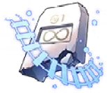 <b>朱•Shijie</b>
      <code>Lv. 65</code>
    </td>
  </tr>
  <tr>
    <td align="center"><b>Asia Server</b></td>
    <td align="center"><b>UID Hide</b></td>
  </tr>
</table>

<h2 align="center">
  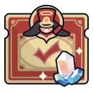 Daily Rewards
  Honkai Star Rail 
</h2>
<table align="center">
  <tr>
    <td align="center"><b>Total Rewards Claimed:</b> <code>4</code></td>
  </tr>
  <tr>
    <td align="center">
      <b>Last Claimed Reward:</b> <a
        href="https://act.hoyolab.com/bbs/event/signin/hkrpg/index.html?act_id=e202303301540311"
        ></a
      > 
      <b>1 x Canned Soda</b>
    </td>
  </tr>
  <tr>
    <td align="center"><b>Last Checked: 🕒 2025-04-04 09:21:26+08:00</b></td>
  </tr>
</table>

<h2 align="center">
  
  Stats
  
</h2>
<table align="center">
  <tr>
    <td>Days Active</td>
    <td align="center"><b>305</b></td>
  </tr>
  <tr>
    <td>Total Avatar</td>
    <td align="center"><b>32</b></td>
  </tr>
  <tr>
    <td>Total Achievement</td>
    <td align="center"><b>295</b></td>
  </tr>
  <tr>
    <td>Chests Opened</td>
    <td align="center"><b>295</b></td>
  </tr>
  <tr>
    <td>Sticker Pass Dreamscape</td>
    <td align="center"><b>0</b></td>
  </tr>
</table>

<h2 align="center">
   Diary
  
</h2>
<table align="center">
  <tr>
    <td align="center">
       Stellar Jade earned
    </td>
    <td align="center"><b>60</b> <code>(rate -98)</code></td>
  </tr>
  <tr>
    <td align="center">
      
      Pass & Special Pass earned
    </td>
    <td align="center"><b>0</b> <code>(rate -100)</code></td>
  </tr>
  <tr>
    <td align="center">
      
      Categories
    </td>
    <td>
      Daily Activity: <b>60</b> <code>(100%)</code> Event: <b>0</b>
      <code>(0%)</code> Adventure Rewards: <b>0</b> <code>(0%)</code
      > Simulated Universe: <b>0</b> <code>(0%)</code> Forgotten Hall:
      <b>0</b> <code>(0%)</code> Mail: <b>0</b> <code>(0%)</code
      > Other: <b>0</b> <code>(0%)</code> 
    </td>
  </tr>
</table>

  

<h2 align="center">
  
  Characters
  
</h2>

  

    <b> Trailblazer </b>
  

   
  <table align="center">
    <tr>
      <th align="center">
        <h3>
          
          Trailblazer
        </h3>
      </th>
      <th align="center">
        <h3>
          
          Victory In a Blink
        </h3>
      </th>
    </tr>
    <tr>
      <td>
        

          
        

      </td>
      <td>
        

          
        

      </td>
    </tr>
    <tr>
      <td>
        <table align="center">
          <tr>
            <td>Rarity</td>
            <td align="center">⭐⭐⭐⭐⭐</td>
          </tr>
          <tr>
            <td>Element</td>
            <td align="center">
              
              Ice
            </td>
          </tr>
          <tr>
            <td>Level</td>
            <td align="center"><code>+80</code></td>
          </tr>
          <tr>
            <td>Eidolon</td>
            <td align="center"><code>6</code></td>
          </tr>
          <tr>
            <td>Relics</td>
            <td align="center">
              
              <code>+3</code> 
              ⭐⭐⭐⭐⭐ 
              Hunter's Artaius Hood 
              <code>+0</code> 
              ⭐⭐⭐⭐⭐ 
              Hunter's Lizard Gloves 
              <code>+0</code> 
              ⭐⭐⭐⭐⭐ 
              Hunter's Ice Dragon Cloak 
              <code>+9</code> 
              ⭐⭐⭐⭐⭐ 
              Hunter's Soft Elkskin Boots 
            </td>
          </tr>
          <tr>
            <td>Planar</td>
            <td align="center">
              
              <code>+0</code> 
              ⭐⭐⭐⭐ 
              Lushaka's Waterscape 
              <code>+0</code> 
              ⭐⭐⭐⭐⭐ 
              Lushaka's Twinlanes 
            </td>
          </tr>
        </table>
      </td>
      <td valign="top">
        <table align="center">
          <tr>
            <td>Name</td>
            <td align="center">Victory In a Blink</td>
          </tr>
          <tr>
            <td>Rarity</td>
            <td align="center">⭐⭐⭐⭐</td>
          </tr>
          <tr>
            <td>Level</td>
            <td align="center"><code>+80</code></td>
          </tr>
          <tr>
            <td>Superimpose</td>
            <td align="center"><code>1</code></td>
          </tr>
        </table>
      </td>
    </tr>
  </table>

  

    <b> Aglaea </b>
  

   
  <table align="center">
    <tr>
      <th align="center">
        <h3>
          
          Aglaea
        </h3>
      </th>
      <th align="center">
        <h3>
          
          Time Woven Into Gold
        </h3>
      </th>
    </tr>
    <tr>
      <td>
        

          
        

      </td>
      <td>
        

          
        

      </td>
    </tr>
    <tr>
      <td>
        <table align="center">
          <tr>
            <td>Rarity</td>
            <td align="center">⭐⭐⭐⭐⭐</td>
          </tr>
          <tr>
            <td>Element</td>
            <td align="center">
              
              Lightning
            </td>
          </tr>
          <tr>
            <td>Level</td>
            <td align="center"><code>+80</code></td>
          </tr>
          <tr>
            <td>Eidolon</td>
            <td align="center"><code>0</code></td>
          </tr>
          <tr>
            <td>Relics</td>
            <td align="center">
              
              <code>+15</code> 
              ⭐⭐⭐⭐⭐ 
              Musketeer's Wild Wheat Felt Hat 
              <code>+15</code> 
              ⭐⭐⭐⭐⭐ 
              Musketeer's Coarse Leather Gloves 
              <code>+15</code> 
              ⭐⭐⭐⭐⭐ 
              Musketeer's Wind-Hunting Shawl 
              <code>+15</code> 
              ⭐⭐⭐⭐⭐ 
              Musketeer's Rivets Riding Boots 
            </td>
          </tr>
          <tr>
            <td>Planar</td>
            <td align="center">
              
              <code>+15</code> 
              ⭐⭐⭐⭐⭐ 
              Talia's Nailscrap Town 
              <code>+15</code> 
              ⭐⭐⭐⭐⭐ 
              Talia's Exposed Electric Wire 
            </td>
          </tr>
        </table>
      </td>
      <td valign="top">
        <table align="center">
          <tr>
            <td>Name</td>
            <td align="center">Time Woven Into Gold</td>
          </tr>
          <tr>
            <td>Rarity</td>
            <td align="center">⭐⭐⭐⭐⭐</td>
          </tr>
          <tr>
            <td>Level</td>
            <td align="center"><code>+80</code></td>
          </tr>
          <tr>
            <td>Superimpose</td>
            <td align="center"><code>1</code></td>
          </tr>
        </table>
      </td>
    </tr>
  </table>

  

    <b> Huohuo </b>
  

   
  <table align="center">
    <tr>
      <th align="center">
        <h3>
          
          Huohuo
        </h3>
      </th>
      <th align="center">
        <h3>
          
          Quid Pro Quo
        </h3>
      </th>
    </tr>
    <tr>
      <td>
        

          
        

      </td>
      <td>
        

          
        

      </td>
    </tr>
    <tr>
      <td>
        <table align="center">
          <tr>
            <td>Rarity</td>
            <td align="center">⭐⭐⭐⭐⭐</td>
          </tr>
          <tr>
            <td>Element</td>
            <td align="center">
              
              Wind
            </td>
          </tr>
          <tr>
            <td>Level</td>
            <td align="center"><code>+80</code></td>
          </tr>
          <tr>
            <td>Eidolon</td>
            <td align="center"><code>0</code></td>
          </tr>
          <tr>
            <td>Relics</td>
            <td align="center">
              
              <code>+15</code> 
              ⭐⭐⭐⭐⭐ 
              Passerby's Rejuvenated Wooden Hairstick 
              <code>+15</code> 
              ⭐⭐⭐⭐⭐ 
              Passerby's Roaming Dragon Bracer 
              <code>+15</code> 
              ⭐⭐⭐⭐⭐ 
              Passerby's Ragged Embroided Coat 
              <code>+15</code> 
              ⭐⭐⭐⭐⭐ 
              Passerby's Stygian Hiking Boots 
            </td>
          </tr>
          <tr>
            <td>Planar</td>
            <td align="center">
              
              <code>+12</code> 
              ⭐⭐⭐⭐ 
              The Xianzhou Luofu's Celestial Ark 
              <code>+12</code> 
              ⭐⭐⭐⭐ 
              The Xianzhou Luofu's Ambrosial Arbor Vines 
            </td>
          </tr>
        </table>
      </td>
      <td valign="top">
        <table align="center">
          <tr>
            <td>Name</td>
            <td align="center">Quid Pro Quo</td>
          </tr>
          <tr>
            <td>Rarity</td>
            <td align="center">⭐⭐⭐⭐</td>
          </tr>
          <tr>
            <td>Level</td>
            <td align="center"><code>+80</code></td>
          </tr>
          <tr>
            <td>Superimpose</td>
            <td align="center"><code>1</code></td>
          </tr>
        </table>
      </td>
    </tr>
  </table>

  

    <b> Topaz & Numby </b>
  

   
  <table align="center">
    <tr>
      <th align="center">
        <h3>
          
          Topaz & Numby
        </h3>
      </th>
      <th align="center">
        <h3>
          
          Swordplay
        </h3>
      </th>
    </tr>
    <tr>
      <td>
        

          
        

      </td>
      <td>
        

          
        

      </td>
    </tr>
    <tr>
      <td>
        <table align="center">
          <tr>
            <td>Rarity</td>
            <td align="center">⭐⭐⭐⭐⭐</td>
          </tr>
          <tr>
            <td>Element</td>
            <td align="center">
              
              Fire
            </td>
          </tr>
          <tr>
            <td>Level</td>
            <td align="center"><code>+80</code></td>
          </tr>
          <tr>
            <td>Eidolon</td>
            <td align="center"><code>0</code></td>
          </tr>
          <tr>
            <td>Relics</td>
            <td align="center">
              
              <code>+15</code> 
              ⭐⭐⭐⭐⭐ 
              Poet's Dill Wreath 
              <code>+15</code> 
              ⭐⭐⭐⭐⭐ 
              Poet's Gilded Bracelet 
              <code>+15</code> 
              ⭐⭐⭐⭐⭐ 
              Champion's Chest Guard 
              <code>+0</code> 
              ⭐⭐⭐⭐⭐ 
              Thief's Meteor Boots 
            </td>
          </tr>
          <tr>
            <td>Planar</td>
            <td align="center">
              
              <code>+0</code> 
              ⭐⭐⭐⭐⭐ 
              BananAmusement Park's BananAxis Plaza 
              <code>+0</code> 
              ⭐⭐⭐⭐⭐ 
              BananAmusement Park's Memetic Cables 
            </td>
          </tr>
        </table>
      </td>
      <td valign="top">
        <table align="center">
          <tr>
            <td>Name</td>
            <td align="center">Swordplay</td>
          </tr>
          <tr>
            <td>Rarity</td>
            <td align="center">⭐⭐⭐⭐</td>
          </tr>
          <tr>
            <td>Level</td>
            <td align="center"><code>+80</code></td>
          </tr>
          <tr>
            <td>Superimpose</td>
            <td align="center"><code>1</code></td>
          </tr>
        </table>
      </td>
    </tr>
  </table>

  

    <b> Tingyun </b>
  

   
  <table align="center">
    <tr>
      <th align="center">
        <h3>
          
          Tingyun
        </h3>
      </th>
      <th align="center">
        <h3>
          
          Dance! Dance! Dance!
        </h3>
      </th>
    </tr>
    <tr>
      <td>
        

          
        

      </td>
      <td>
        

          
        

      </td>
    </tr>
    <tr>
      <td>
        <table align="center">
          <tr>
            <td>Rarity</td>
            <td align="center">⭐⭐⭐⭐</td>
          </tr>
          <tr>
            <td>Element</td>
            <td align="center">
              
              Lightning
            </td>
          </tr>
          <tr>
            <td>Level</td>
            <td align="center"><code>+80</code></td>
          </tr>
          <tr>
            <td>Eidolon</td>
            <td align="center"><code>6</code></td>
          </tr>
          <tr>
            <td>Relics</td>
            <td align="center">
              
              <code>+0</code> 
              ⭐⭐⭐⭐⭐ 
              Musketeer's Wild Wheat Felt Hat 
              <code>+0</code> 
              ⭐⭐⭐⭐⭐ 
              Musketeer's Coarse Leather Gloves 
              <code>+0</code> 
              ⭐⭐⭐⭐⭐ 
              Musketeer's Wind-Hunting Shawl 
              <code>+0</code> 
              ⭐⭐⭐⭐⭐ 
              Musketeer's Rivets Riding Boots 
            </td>
          </tr>
          <tr>
            <td>Planar</td>
            <td align="center">
              
              <code>+0</code> 
              ⭐⭐⭐⭐⭐ 
              The Xianzhou Luofu's Celestial Ark 
              <code>+0</code> 
              ⭐⭐⭐⭐ 
              The Xianzhou Luofu's Ambrosial Arbor Vines 
            </td>
          </tr>
        </table>
      </td>
      <td valign="top">
        <table align="center">
          <tr>
            <td>Name</td>
            <td align="center">Dance! Dance! Dance!</td>
          </tr>
          <tr>
            <td>Rarity</td>
            <td align="center">⭐⭐⭐⭐</td>
          </tr>
          <tr>
            <td>Level</td>
            <td align="center"><code>+80</code></td>
          </tr>
          <tr>
            <td>Superimpose</td>
            <td align="center"><code>1</code></td>
          </tr>
        </table>
      </td>
    </tr>
  </table>

  

    <b> Tribbie </b>
  

   
  <table align="center">
    <tr>
      <th align="center">
        <h3>
          
          Tribbie
        </h3>
      </th>
      <th align="center">
        <h3>
          
          Dance! Dance! Dance!
        </h3>
      </th>
    </tr>
    <tr>
      <td>
        

          
        

      </td>
      <td>
        

          
        

      </td>
    </tr>
    <tr>
      <td>
        <table align="center">
          <tr>
            <td>Rarity</td>
            <td align="center">⭐⭐⭐⭐⭐</td>
          </tr>
          <tr>
            <td>Element</td>
            <td align="center">
              
              Quantum
            </td>
          </tr>
          <tr>
            <td>Level</td>
            <td align="center"><code>+70</code></td>
          </tr>
          <tr>
            <td>Eidolon</td>
            <td align="center"><code>0</code></td>
          </tr>
          <tr>
            <td>Relics</td>
            <td align="center">
              
              <code>+0</code> 
              ⭐⭐⭐⭐⭐ 
              Poet's Dill Wreath 
              <code>+0</code> 
              ⭐⭐⭐⭐⭐ 
              Poet's Gilded Bracelet 
              <code>+0</code> 
              ⭐⭐⭐⭐⭐ 
              Poet's Star-Studded Skirt 
              <code>+0</code> 
              ⭐⭐⭐⭐⭐ 
              Poet's Silver-Studded Shoes 
            </td>
          </tr>
          <tr>
            <td>Planar</td>
            <td align="center">
              
              <code>+0</code> 
              ⭐⭐⭐⭐ 
              Lushaka's Waterscape 
              <code>+0</code> 
              ⭐⭐⭐⭐⭐ 
              Lushaka's Twinlanes 
            </td>
          </tr>
        </table>
      </td>
      <td valign="top">
        <table align="center">
          <tr>
            <td>Name</td>
            <td align="center">Dance! Dance! Dance!</td>
          </tr>
          <tr>
            <td>Rarity</td>
            <td align="center">⭐⭐⭐⭐</td>
          </tr>
          <tr>
            <td>Level</td>
            <td align="center"><code>+30</code></td>
          </tr>
          <tr>
            <td>Superimpose</td>
            <td align="center"><code>1</code></td>
          </tr>
        </table>
      </td>
    </tr>
  </table>

  

    <b> Dan Heng • Imbibitor Lunae </b>
  

   
  <table align="center">
    <tr>
      <th align="center">
        <h3>
          
          Dan Heng • Imbibitor Lunae
        </h3>
      </th>
      <th align="center">
        <h3>
          
          Woof! Walk Time!
        </h3>
      </th>
    </tr>
    <tr>
      <td>
        

          
        

      </td>
      <td>
        

          
        

      </td>
    </tr>
    <tr>
      <td>
        <table align="center">
          <tr>
            <td>Rarity</td>
            <td align="center">⭐⭐⭐⭐⭐</td>
          </tr>
          <tr>
            <td>Element</td>
            <td align="center">
              
              Imaginary
            </td>
          </tr>
          <tr>
            <td>Level</td>
            <td align="center"><code>+70</code></td>
          </tr>
          <tr>
            <td>Eidolon</td>
            <td align="center"><code>0</code></td>
          </tr>
          <tr>
            <td>Relics</td>
            <td align="center">
              
              <code>+15</code> 
              ⭐⭐⭐⭐⭐ 
              Musketeer's Wild Wheat Felt Hat 
              <code>+15</code> 
              ⭐⭐⭐⭐⭐ 
              Musketeer's Coarse Leather Gloves 
              <code>+15</code> 
              ⭐⭐⭐⭐⭐ 
              Musketeer's Wind-Hunting Shawl 
              <code>+15</code> 
              ⭐⭐⭐⭐⭐ 
              Musketeer's Rivets Riding Boots 
            </td>
          </tr>
          <tr>
            <td>Planar</td>
            <td align="center">
              
              <code>+15</code> 
              ⭐⭐⭐⭐⭐ 
              Herta's Space Station 
              <code>+12</code> 
              ⭐⭐⭐⭐ 
              Herta's Wandering Trek 
            </td>
          </tr>
        </table>
      </td>
      <td valign="top">
        <table align="center">
          <tr>
            <td>Name</td>
            <td align="center">Woof! Walk Time!</td>
          </tr>
          <tr>
            <td>Rarity</td>
            <td align="center">⭐⭐⭐⭐</td>
          </tr>
          <tr>
            <td>Level</td>
            <td align="center"><code>+70</code></td>
          </tr>
          <tr>
            <td>Superimpose</td>
            <td align="center"><code>2</code></td>
          </tr>
        </table>
      </td>
    </tr>
  </table>

  

    <b> Bailu </b>
  

   
  <table align="center">
    <tr>
      <th align="center">
        <h3>
          
          Bailu
        </h3>
      </th>
      <th align="center">
        <h3>
          
          Time Waits for No One
        </h3>
      </th>
    </tr>
    <tr>
      <td>
        

          
        

      </td>
      <td>
        

          
        

      </td>
    </tr>
    <tr>
      <td>
        <table align="center">
          <tr>
            <td>Rarity</td>
            <td align="center">⭐⭐⭐⭐⭐</td>
          </tr>
          <tr>
            <td>Element</td>
            <td align="center">
              
              Lightning
            </td>
          </tr>
          <tr>
            <td>Level</td>
            <td align="center"><code>+70</code></td>
          </tr>
          <tr>
            <td>Eidolon</td>
            <td align="center"><code>0</code></td>
          </tr>
          <tr>
            <td>Relics</td>
            <td align="center">
              
              <code>+15</code> 
              ⭐⭐⭐⭐⭐ 
              Passerby's Rejuvenated Wooden Hairstick 
              <code>+15</code> 
              ⭐⭐⭐⭐⭐ 
              Passerby's Roaming Dragon Bracer 
              <code>+15</code> 
              ⭐⭐⭐⭐⭐ 
              Passerby's Ragged Embroided Coat 
              <code>+15</code> 
              ⭐⭐⭐⭐⭐ 
              Passerby's Stygian Hiking Boots 
            </td>
          </tr>
          <tr>
            <td>Planar</td>
            <td align="center">
              
              <code>+15</code> 
              ⭐⭐⭐⭐⭐ 
              Talia's Nailscrap Town 
              <code>+12</code> 
              ⭐⭐⭐⭐ 
              Talia's Exposed Electric Wire 
            </td>
          </tr>
        </table>
      </td>
      <td valign="top">
        <table align="center">
          <tr>
            <td>Name</td>
            <td align="center">Time Waits for No One</td>
          </tr>
          <tr>
            <td>Rarity</td>
            <td align="center">⭐⭐⭐⭐⭐</td>
          </tr>
          <tr>
            <td>Level</td>
            <td align="center"><code>+70</code></td>
          </tr>
          <tr>
            <td>Superimpose</td>
            <td align="center"><code>1</code></td>
          </tr>
        </table>
      </td>
    </tr>
  </table>

  

    <b> Yanqing </b>
  

   
  <table align="center">
    <tr>
      <th align="center">
        <h3>
          
          Yanqing
        </h3>
      </th>
      <th align="center">
        <h3>
          
          River Flows in Spring
        </h3>
      </th>
    </tr>
    <tr>
      <td>
        

          
        

      </td>
      <td>
        

          
        

      </td>
    </tr>
    <tr>
      <td>
        <table align="center">
          <tr>
            <td>Rarity</td>
            <td align="center">⭐⭐⭐⭐⭐</td>
          </tr>
          <tr>
            <td>Element</td>
            <td align="center">
              
              Ice
            </td>
          </tr>
          <tr>
            <td>Level</td>
            <td align="center"><code>+70</code></td>
          </tr>
          <tr>
            <td>Eidolon</td>
            <td align="center"><code>0</code></td>
          </tr>
          <tr>
            <td>Relics</td>
            <td align="center">
              
              <code>+12</code> 
              ⭐⭐⭐⭐ 
              Hunter's Artaius Hood 
              <code>+12</code> 
              ⭐⭐⭐⭐ 
              Hunter's Lizard Gloves 
              <code>+12</code> 
              ⭐⭐⭐⭐ 
              Hunter's Ice Dragon Cloak 
              <code>+12</code> 
              ⭐⭐⭐⭐ 
              Hunter's Soft Elkskin Boots 
            </td>
          </tr>
          <tr>
            <td>Planar</td>
            <td align="center">
              
              <code>+12</code> 
              ⭐⭐⭐⭐ 
              Herta's Space Station 
              <code>+12</code> 
              ⭐⭐⭐⭐ 
              Herta's Wandering Trek 
            </td>
          </tr>
        </table>
      </td>
      <td valign="top">
        <table align="center">
          <tr>
            <td>Name</td>
            <td align="center">River Flows in Spring</td>
          </tr>
          <tr>
            <td>Rarity</td>
            <td align="center">⭐⭐⭐⭐</td>
          </tr>
          <tr>
            <td>Level</td>
            <td align="center"><code>+60</code></td>
          </tr>
          <tr>
            <td>Superimpose</td>
            <td align="center"><code>3</code></td>
          </tr>
        </table>
      </td>
    </tr>
  </table>

  

    <b> Clara </b>
  

   
  <table align="center">
    <tr>
      <th align="center">
        <h3>
          
          Clara
        </h3>
      </th>
      <th align="center">
        <h3>
          
          Indelible Promise
        </h3>
      </th>
    </tr>
    <tr>
      <td>
        

          
        

      </td>
      <td>
        

          
        

      </td>
    </tr>
    <tr>
      <td>
        <table align="center">
          <tr>
            <td>Rarity</td>
            <td align="center">⭐⭐⭐⭐⭐</td>
          </tr>
          <tr>
            <td>Element</td>
            <td align="center">
              
              Physical
            </td>
          </tr>
          <tr>
            <td>Level</td>
            <td align="center"><code>+70</code></td>
          </tr>
          <tr>
            <td>Eidolon</td>
            <td align="center"><code>1</code></td>
          </tr>
          <tr>
            <td>Relics</td>
            <td align="center">
              
              <code>+0</code> 
              ⭐⭐⭐⭐ 
              Thief's Myriad-Faced Mask 
              <code>+0</code> 
              ⭐⭐⭐⭐⭐ 
              Thief's Gloves With Prints 
              <code>+0</code> 
              ⭐⭐⭐⭐ 
              Thief's Steel Grappling Hook 
              <code>+0</code> 
              ⭐⭐⭐⭐ 
              Thief's Meteor Boots 
            </td>
          </tr>
          <tr>
            <td>Planar</td>
            <td align="center">
              
              <code>+0</code> 
              ⭐⭐⭐⭐ 
              Herta's Space Station 
              <code>+0</code> 
              ⭐⭐⭐⭐ 
              Herta's Wandering Trek 
            </td>
          </tr>
        </table>
      </td>
      <td valign="top">
        <table align="center">
          <tr>
            <td>Name</td>
            <td align="center">Indelible Promise</td>
          </tr>
          <tr>
            <td>Rarity</td>
            <td align="center">⭐⭐⭐⭐</td>
          </tr>
          <tr>
            <td>Level</td>
            <td align="center"><code>+1</code></td>
          </tr>
          <tr>
            <td>Superimpose</td>
            <td align="center"><code>1</code></td>
          </tr>
        </table>
      </td>
    </tr>
  </table>

  

    <b> Yukong </b>
  

   
  <table align="center">
    <tr>
      <th align="center">
        <h3>
          
          Yukong
        </h3>
      </th>
      <th align="center">
        <h3>
          
          Mediation
        </h3>
      </th>
    </tr>
    <tr>
      <td>
        

          
        

      </td>
      <td>
        

          
        

      </td>
    </tr>
    <tr>
      <td>
        <table align="center">
          <tr>
            <td>Rarity</td>
            <td align="center">⭐⭐⭐⭐</td>
          </tr>
          <tr>
            <td>Element</td>
            <td align="center">
              
              Imaginary
            </td>
          </tr>
          <tr>
            <td>Level</td>
            <td align="center"><code>+70</code></td>
          </tr>
          <tr>
            <td>Eidolon</td>
            <td align="center"><code>4</code></td>
          </tr>
          <tr>
            <td>Relics</td>
            <td align="center">
              
              <code>+14</code> 
              ⭐⭐⭐⭐⭐ 
              Musketeer's Wild Wheat Felt Hat 
              <code>+0</code> 
              ⭐⭐⭐⭐⭐ 
              Musketeer's Coarse Leather Gloves 
              <code>+0</code> 
              ⭐⭐⭐⭐⭐ 
              Musketeer's Wind-Hunting Shawl 
              <code>+13</code> 
              ⭐⭐⭐⭐⭐ 
              Musketeer's Rivets Riding Boots 
            </td>
          </tr>
          <tr>
            <td>Planar</td>
            <td align="center">
              
              <code>+0</code> 
              ⭐⭐⭐⭐ 
              The Xianzhou Luofu's Celestial Ark 
              <code>+0</code> 
              ⭐⭐⭐⭐ 
              The Xianzhou Luofu's Ambrosial Arbor Vines 
            </td>
          </tr>
        </table>
      </td>
      <td valign="top">
        <table align="center">
          <tr>
            <td>Name</td>
            <td align="center">Mediation</td>
          </tr>
          <tr>
            <td>Rarity</td>
            <td align="center">⭐⭐⭐</td>
          </tr>
          <tr>
            <td>Level</td>
            <td align="center"><code>+50</code></td>
          </tr>
          <tr>
            <td>Superimpose</td>
            <td align="center"><code>4</code></td>
          </tr>
        </table>
      </td>
    </tr>
  </table>

  

    <b> Black Swan </b>
  

   
  <table align="center">
    <tr>
      <th align="center">
        <h3>
          
          Black Swan
        </h3>
      </th>
      <th align="center">
        <h3>
          
          Fermata
        </h3>
      </th>
    </tr>
    <tr>
      <td>
        

          
        

      </td>
      <td>
        

          
        

      </td>
    </tr>
    <tr>
      <td>
        <table align="center">
          <tr>
            <td>Rarity</td>
            <td align="center">⭐⭐⭐⭐⭐</td>
          </tr>
          <tr>
            <td>Element</td>
            <td align="center">
              
              Wind
            </td>
          </tr>
          <tr>
            <td>Level</td>
            <td align="center"><code>+60</code></td>
          </tr>
          <tr>
            <td>Eidolon</td>
            <td align="center"><code>0</code></td>
          </tr>
          <tr>
            <td>Relics</td>
            <td align="center">
              
              <code>+11</code> 
              ⭐⭐⭐⭐⭐ 
              Eagle's Beaked Helmet 
              <code>+0</code> 
              ⭐⭐⭐⭐ 
              Eagle's Soaring Ring 
              <code>+2</code> 
              ⭐⭐⭐⭐⭐ 
              Eagle's Winged Suit Harness 
              <code>+0</code> 
              ⭐⭐⭐⭐⭐ 
              Eagle's Quilted Puttees 
            </td>
          </tr>
          <tr>
            <td>Planar</td>
            <td align="center">
              
              <code>+0</code> 
              ⭐⭐⭐⭐ 
              Herta's Space Station 
              <code>+0</code> 
              ⭐⭐⭐⭐ 
              Herta's Wandering Trek 
            </td>
          </tr>
        </table>
      </td>
      <td valign="top">
        <table align="center">
          <tr>
            <td>Name</td>
            <td align="center">Fermata</td>
          </tr>
          <tr>
            <td>Rarity</td>
            <td align="center">⭐⭐⭐⭐</td>
          </tr>
          <tr>
            <td>Level</td>
            <td align="center"><code>+1</code></td>
          </tr>
          <tr>
            <td>Superimpose</td>
            <td align="center"><code>1</code></td>
          </tr>
        </table>
      </td>
    </tr>
  </table>

  

    <b> Gepard </b>
  

   
  <table align="center">
    <tr>
      <th align="center">
        <h3>
          
          Gepard
        </h3>
      </th>
      <th align="center">
        <h3>
          
          We Are Wildfire
        </h3>
      </th>
    </tr>
    <tr>
      <td>
        

          
        

      </td>
      <td>
        

          
        

      </td>
    </tr>
    <tr>
      <td>
        <table align="center">
          <tr>
            <td>Rarity</td>
            <td align="center">⭐⭐⭐⭐⭐</td>
          </tr>
          <tr>
            <td>Element</td>
            <td align="center">
              
              Ice
            </td>
          </tr>
          <tr>
            <td>Level</td>
            <td align="center"><code>+60</code></td>
          </tr>
          <tr>
            <td>Eidolon</td>
            <td align="center"><code>0</code></td>
          </tr>
          <tr>
            <td>Relics</td>
            <td align="center">
              
              <code>+12</code> 
              ⭐⭐⭐⭐ 
              Knight's Forgiving Casque 
              <code>+12</code> 
              ⭐⭐⭐⭐ 
              Knight's Silent Oath Ring 
              <code>+11</code> 
              ⭐⭐⭐⭐ 
              Knight's Solemn Breastplate 
              <code>+0</code> 
              ⭐⭐⭐⭐ 
              Knight's Iron Boots of Order 
            </td>
          </tr>
          <tr>
            <td>Planar</td>
            <td align="center">
              
              <code>+0</code> 
              ⭐⭐⭐⭐ 
              Herta's Space Station 
              <code>+0</code> 
              ⭐⭐⭐⭐ 
              Herta's Wandering Trek 
            </td>
          </tr>
        </table>
      </td>
      <td valign="top">
        <table align="center">
          <tr>
            <td>Name</td>
            <td align="center">We Are Wildfire</td>
          </tr>
          <tr>
            <td>Rarity</td>
            <td align="center">⭐⭐⭐⭐</td>
          </tr>
          <tr>
            <td>Level</td>
            <td align="center"><code>+50</code></td>
          </tr>
          <tr>
            <td>Superimpose</td>
            <td align="center"><code>1</code></td>
          </tr>
        </table>
      </td>
    </tr>
  </table>

  

    <b> Bronya </b>
  

   
  <table align="center">
    <tr>
      <th align="center">
        <h3>
          
          Bronya
        </h3>
      </th>
      <th align="center">
        <h3>
          
          Meshing Cogs
        </h3>
      </th>
    </tr>
    <tr>
      <td>
        

          
        

      </td>
      <td>
        

          
        

      </td>
    </tr>
    <tr>
      <td>
        <table align="center">
          <tr>
            <td>Rarity</td>
            <td align="center">⭐⭐⭐⭐⭐</td>
          </tr>
          <tr>
            <td>Element</td>
            <td align="center">
              
              Wind
            </td>
          </tr>
          <tr>
            <td>Level</td>
            <td align="center"><code>+60</code></td>
          </tr>
          <tr>
            <td>Eidolon</td>
            <td align="center"><code>0</code></td>
          </tr>
          <tr>
            <td>Relics</td>
            <td align="center">
              
              <code>+12</code> 
              ⭐⭐⭐⭐ 
              Hunter's Artaius Hood 
              <code>+12</code> 
              ⭐⭐⭐⭐ 
              Hunter's Lizard Gloves 
              <code>+12</code> 
              ⭐⭐⭐⭐ 
              Hunter's Ice Dragon Cloak 
              <code>+12</code> 
              ⭐⭐⭐⭐ 
              Hunter's Soft Elkskin Boots 
            </td>
          </tr>
          <tr>
            <td>Planar</td>
            <td align="center">
              
              <code>+9</code> 
              ⭐⭐⭐ 
              The Xianzhou Luofu's Celestial Ark 
              <code>+12</code> 
              ⭐⭐⭐⭐ 
              The Xianzhou Luofu's Ambrosial Arbor Vines 
            </td>
          </tr>
        </table>
      </td>
      <td valign="top">
        <table align="center">
          <tr>
            <td>Name</td>
            <td align="center">Meshing Cogs</td>
          </tr>
          <tr>
            <td>Rarity</td>
            <td align="center">⭐⭐⭐</td>
          </tr>
          <tr>
            <td>Level</td>
            <td align="center"><code>+60</code></td>
          </tr>
          <tr>
            <td>Superimpose</td>
            <td align="center"><code>5</code></td>
          </tr>
        </table>
      </td>
    </tr>
  </table>

  

    <b> Natasha </b>
  

   
  <table align="center">
    <tr>
      <th align="center">
        <h3>
          
          Natasha
        </h3>
      </th>
      <th align="center">
        <h3>
          
          Post-Op Conversation
        </h3>
      </th>
    </tr>
    <tr>
      <td>
        

          
        

      </td>
      <td>
        

          
        

      </td>
    </tr>
    <tr>
      <td>
        <table align="center">
          <tr>
            <td>Rarity</td>
            <td align="center">⭐⭐⭐⭐</td>
          </tr>
          <tr>
            <td>Element</td>
            <td align="center">
              
              Physical
            </td>
          </tr>
          <tr>
            <td>Level</td>
            <td align="center"><code>+60</code></td>
          </tr>
          <tr>
            <td>Eidolon</td>
            <td align="center"><code>2</code></td>
          </tr>
          <tr>
            <td>Relics</td>
            <td align="center">
              
              <code>+0</code> 
              ⭐⭐⭐⭐⭐ 
              Passerby's Rejuvenated Wooden Hairstick 
              <code>+0</code> 
              ⭐⭐⭐⭐⭐ 
              Passerby's Roaming Dragon Bracer 
              <code>+0</code> 
              ⭐⭐⭐⭐⭐ 
              Passerby's Ragged Embroided Coat 
              <code>+0</code> 
              ⭐⭐⭐⭐⭐ 
              Passerby's Stygian Hiking Boots 
            </td>
          </tr>
          <tr>
            <td>Planar</td>
            <td align="center">
              
              <code>+0</code> 
              ⭐⭐⭐⭐ 
              The Xianzhou Luofu's Celestial Ark 
              <code>+0</code> 
              ⭐⭐⭐⭐ 
              The Xianzhou Luofu's Ambrosial Arbor Vines 
            </td>
          </tr>
        </table>
      </td>
      <td valign="top">
        <table align="center">
          <tr>
            <td>Name</td>
            <td align="center">Post-Op Conversation</td>
          </tr>
          <tr>
            <td>Rarity</td>
            <td align="center">⭐⭐⭐⭐</td>
          </tr>
          <tr>
            <td>Level</td>
            <td align="center"><code>+38</code></td>
          </tr>
          <tr>
            <td>Superimpose</td>
            <td align="center"><code>2</code></td>
          </tr>
        </table>
      </td>
    </tr>
  </table>

  

    <b> Serval </b>
  

   
  <table align="center">
    <tr>
      <th align="center">
        <h3>
          
          Serval
        </h3>
      </th>
      <th align="center">
        <h3>
          
          Passkey
        </h3>
      </th>
    </tr>
    <tr>
      <td>
        

          
        

      </td>
      <td>
        

          
        

      </td>
    </tr>
    <tr>
      <td>
        <table align="center">
          <tr>
            <td>Rarity</td>
            <td align="center">⭐⭐⭐⭐</td>
          </tr>
          <tr>
            <td>Element</td>
            <td align="center">
              
              Lightning
            </td>
          </tr>
          <tr>
            <td>Level</td>
            <td align="center"><code>+60</code></td>
          </tr>
          <tr>
            <td>Eidolon</td>
            <td align="center"><code>6</code></td>
          </tr>
          <tr>
            <td>Relics</td>
            <td align="center">
              
              <code>+0</code> 
              ⭐⭐⭐⭐⭐ 
              Band's Polarized Sunglasses 
              <code>+0</code> 
              ⭐⭐⭐⭐⭐ 
              Band's Touring Bracelet 
              <code>+0</code> 
              ⭐⭐⭐⭐ 
              Band's Leather Jacket With Studs 
              <code>+0</code> 
              ⭐⭐⭐⭐⭐ 
              Band's Ankle Boots With Rivets 
            </td>
          </tr>
          <tr>
            <td>Planar</td>
            <td align="center">
              
              <code>+0</code> 
              ⭐⭐⭐⭐ 
              Herta's Space Station 
              <code>+0</code> 
              ⭐⭐⭐⭐ 
              Herta's Wandering Trek 
            </td>
          </tr>
        </table>
      </td>
      <td valign="top">
        <table align="center">
          <tr>
            <td>Name</td>
            <td align="center">Passkey</td>
          </tr>
          <tr>
            <td>Rarity</td>
            <td align="center">⭐⭐⭐</td>
          </tr>
          <tr>
            <td>Level</td>
            <td align="center"><code>+58</code></td>
          </tr>
          <tr>
            <td>Superimpose</td>
            <td align="center"><code>5</code></td>
          </tr>
        </table>
      </td>
    </tr>
  </table>

  

    <b> Asta </b>
  

   
  <table align="center">
    <tr>
      <th align="center">
        <h3>
          
          Asta
        </h3>
      </th>
      <th align="center">
        <h3>
          
          Chorus
        </h3>
      </th>
    </tr>
    <tr>
      <td>
        

          
        

      </td>
      <td>
        

          
        

      </td>
    </tr>
    <tr>
      <td>
        <table align="center">
          <tr>
            <td>Rarity</td>
            <td align="center">⭐⭐⭐⭐</td>
          </tr>
          <tr>
            <td>Element</td>
            <td align="center">
              
              Fire
            </td>
          </tr>
          <tr>
            <td>Level</td>
            <td align="center"><code>+60</code></td>
          </tr>
          <tr>
            <td>Eidolon</td>
            <td align="center"><code>2</code></td>
          </tr>
          <tr>
            <td>Relics</td>
            <td align="center">
              
              <code>+9</code> 
              ⭐⭐⭐ 
              Thief's Myriad-Faced Mask 
              <code>+0</code> 
              ⭐⭐⭐⭐ 
              Thief's Gloves With Prints 
              <code>+0</code> 
              ⭐⭐⭐⭐ 
              Thief's Steel Grappling Hook 
              <code>+0</code> 
              ⭐⭐⭐⭐ 
              Thief's Meteor Boots 
            </td>
          </tr>
          <tr>
            <td>Planar</td>
            <td align="center">
              
              <code>+0</code> 
              ⭐⭐⭐ 
              The Xianzhou Luofu's Celestial Ark 
              <code>+0</code> 
              ⭐⭐⭐⭐ 
              The Xianzhou Luofu's Ambrosial Arbor Vines 
            </td>
          </tr>
        </table>
      </td>
      <td valign="top">
        <table align="center">
          <tr>
            <td>Name</td>
            <td align="center">Chorus</td>
          </tr>
          <tr>
            <td>Rarity</td>
            <td align="center">⭐⭐⭐</td>
          </tr>
          <tr>
            <td>Level</td>
            <td align="center"><code>+50</code></td>
          </tr>
          <tr>
            <td>Superimpose</td>
            <td align="center"><code>1</code></td>
          </tr>
        </table>
      </td>
    </tr>
  </table>

  

    <b> Qingque </b>
  

   
  <table align="center">
    <tr>
      <th align="center">
        <h3>
          
          Qingque
        </h3>
      </th>
      <th align="center">
        <h3>
          
          The Seriousness of Breakfast
        </h3>
      </th>
    </tr>
    <tr>
      <td>
        

          
        

      </td>
      <td>
        

          
        

      </td>
    </tr>
    <tr>
      <td>
        <table align="center">
          <tr>
            <td>Rarity</td>
            <td align="center">⭐⭐⭐⭐</td>
          </tr>
          <tr>
            <td>Element</td>
            <td align="center">
              
              Quantum
            </td>
          </tr>
          <tr>
            <td>Level</td>
            <td align="center"><code>+50</code></td>
          </tr>
          <tr>
            <td>Eidolon</td>
            <td align="center"><code>5</code></td>
          </tr>
          <tr>
            <td>Relics</td>
            <td align="center">
              
              <code>+12</code> 
              ⭐⭐⭐⭐ 
              Musketeer's Wild Wheat Felt Hat 
              <code>+10</code> 
              ⭐⭐⭐⭐ 
              Musketeer's Coarse Leather Gloves 
              <code>+0</code> 
              ⭐⭐⭐⭐ 
              Musketeer's Wind-Hunting Shawl 
              <code>+0</code> 
              ⭐⭐⭐⭐ 
              Musketeer's Rivets Riding Boots 
            </td>
          </tr>
          <tr>
            <td>Planar</td>
            <td align="center">
              
              <code>+0</code> 
              ⭐⭐⭐⭐ 
              Herta's Space Station 
              <code>+0</code> 
              ⭐⭐⭐⭐ 
              Herta's Wandering Trek 
            </td>
          </tr>
        </table>
      </td>
      <td valign="top">
        <table align="center">
          <tr>
            <td>Name</td>
            <td align="center">The Seriousness of Breakfast</td>
          </tr>
          <tr>
            <td>Rarity</td>
            <td align="center">⭐⭐⭐⭐</td>
          </tr>
          <tr>
            <td>Level</td>
            <td align="center"><code>+50</code></td>
          </tr>
          <tr>
            <td>Superimpose</td>
            <td align="center"><code>1</code></td>
          </tr>
        </table>
      </td>
    </tr>
  </table>

  

    <b> Arlan </b>
  

   
  <table align="center">
    <tr>
      <th align="center">
        <h3>
          
          Arlan
        </h3>
      </th>
      <th align="center">
        <h3>
          
          Shattered Home
        </h3>
      </th>
    </tr>
    <tr>
      <td>
        

          
        

      </td>
      <td>
        

          
        

      </td>
    </tr>
    <tr>
      <td>
        <table align="center">
          <tr>
            <td>Rarity</td>
            <td align="center">⭐⭐⭐⭐</td>
          </tr>
          <tr>
            <td>Element</td>
            <td align="center">
              
              Lightning
            </td>
          </tr>
          <tr>
            <td>Level</td>
            <td align="center"><code>+50</code></td>
          </tr>
          <tr>
            <td>Eidolon</td>
            <td align="center"><code>6</code></td>
          </tr>
          <tr>
            <td>Relics</td>
            <td align="center">
              
              <code>+0</code> 
              ⭐⭐⭐⭐ 
              Musketeer's Wild Wheat Felt Hat 
              <code>+0</code> 
              ⭐⭐⭐⭐ 
              Musketeer's Coarse Leather Gloves 
              <code>+0</code> 
              ⭐⭐⭐⭐ 
              Musketeer's Wind-Hunting Shawl 
              <code>+0</code> 
              ⭐⭐⭐⭐ 
              Musketeer's Rivets Riding Boots 
            </td>
          </tr>
          <tr>
            <td>Planar</td>
            <td align="center">
              
              <code>+0</code> 
              ⭐⭐⭐⭐ 
              Herta's Space Station 
              <code>+0</code> 
              ⭐⭐⭐⭐ 
              Herta's Wandering Trek 
            </td>
          </tr>
        </table>
      </td>
      <td valign="top">
        <table align="center">
          <tr>
            <td>Name</td>
            <td align="center">Shattered Home</td>
          </tr>
          <tr>
            <td>Rarity</td>
            <td align="center">⭐⭐⭐</td>
          </tr>
          <tr>
            <td>Level</td>
            <td align="center"><code>+1</code></td>
          </tr>
          <tr>
            <td>Superimpose</td>
            <td align="center"><code>1</code></td>
          </tr>
        </table>
      </td>
    </tr>
  </table>

  

    <b> Sushang </b>
  

   
  <table align="center">
    <tr>
      <th align="center">
        <h3>
          
          Sushang
        </h3>
      </th>
      <th align="center">
        <h3>
          
          Adversarial
        </h3>
      </th>
    </tr>
    <tr>
      <td>
        

          
        

      </td>
      <td>
        

          
        

      </td>
    </tr>
    <tr>
      <td>
        <table align="center">
          <tr>
            <td>Rarity</td>
            <td align="center">⭐⭐⭐⭐</td>
          </tr>
          <tr>
            <td>Element</td>
            <td align="center">
              
              Physical
            </td>
          </tr>
          <tr>
            <td>Level</td>
            <td align="center"><code>+40</code></td>
          </tr>
          <tr>
            <td>Eidolon</td>
            <td align="center"><code>5</code></td>
          </tr>
          <tr>
            <td>Relics</td>
            <td align="center">
              
              <code>+0</code> 
              ⭐⭐⭐⭐ 
              Genius's Ultraremote Sensing Visor 
              <code>+0</code> 
              ⭐⭐⭐⭐ 
              Genius's Frequency Catcher 
              <code>+0</code> 
              ⭐⭐⭐ 
              Musketeer's Wind-Hunting Shawl 
              <code>+0</code> 
              ⭐⭐⭐⭐⭐ 
              Genius's Gravity Walker 
            </td>
          </tr>
          <tr>
            <td>Planar</td>
            <td align="center">
              
              <code>+0</code> 
              ⭐⭐⭐⭐ 
              Herta's Space Station 
              <code>+0</code> 
              ⭐⭐⭐⭐ 
              Herta's Wandering Trek 
            </td>
          </tr>
        </table>
      </td>
      <td valign="top">
        <table align="center">
          <tr>
            <td>Name</td>
            <td align="center">Adversarial</td>
          </tr>
          <tr>
            <td>Rarity</td>
            <td align="center">⭐⭐⭐</td>
          </tr>
          <tr>
            <td>Level</td>
            <td align="center"><code>+1</code></td>
          </tr>
          <tr>
            <td>Superimpose</td>
            <td align="center"><code>1</code></td>
          </tr>
        </table>
      </td>
    </tr>
  </table>

  

    <b> Luka </b>
  

   
  <table align="center">
    <tr>
      <th align="center">
        <h3>
          
          Luka
        </h3>
      </th>
      <th align="center">
        <h3>
          
          Hidden Shadow
        </h3>
      </th>
    </tr>
    <tr>
      <td>
        

          
        

      </td>
      <td>
        

          
        

      </td>
    </tr>
    <tr>
      <td>
        <table align="center">
          <tr>
            <td>Rarity</td>
            <td align="center">⭐⭐⭐⭐</td>
          </tr>
          <tr>
            <td>Element</td>
            <td align="center">
              
              Physical
            </td>
          </tr>
          <tr>
            <td>Level</td>
            <td align="center"><code>+40</code></td>
          </tr>
          <tr>
            <td>Eidolon</td>
            <td align="center"><code>4</code></td>
          </tr>
          <tr>
            <td>Relics</td>
            <td align="center">
              
              <code>+0</code> 
              ⭐⭐⭐⭐ 
              Musketeer's Wild Wheat Felt Hat 
              <code>+0</code> 
              ⭐⭐⭐⭐⭐ 
              Musketeer's Coarse Leather Gloves 
              <code>+0</code> 
              ⭐⭐⭐⭐⭐ 
              Musketeer's Wind-Hunting Shawl 
              <code>+0</code> 
              ⭐⭐⭐⭐⭐ 
              Musketeer's Rivets Riding Boots 
            </td>
          </tr>
          <tr>
            <td>Planar</td>
            <td align="center">
              
              <code>+0</code> 
              ⭐⭐⭐⭐ 
              Herta's Space Station 
              <code>+0</code> 
              ⭐⭐⭐⭐ 
              Herta's Wandering Trek 
            </td>
          </tr>
        </table>
      </td>
      <td valign="top">
        <table align="center">
          <tr>
            <td>Name</td>
            <td align="center">Hidden Shadow</td>
          </tr>
          <tr>
            <td>Rarity</td>
            <td align="center">⭐⭐⭐</td>
          </tr>
          <tr>
            <td>Level</td>
            <td align="center"><code>+1</code></td>
          </tr>
          <tr>
            <td>Superimpose</td>
            <td align="center"><code>1</code></td>
          </tr>
        </table>
      </td>
    </tr>
  </table>

  

    <b> Hook </b>
  

   
  <table align="center">
    <tr>
      <th align="center">
        <h3>
          
          Hook
        </h3>
      </th>
      <th align="center">
        <h3>
          
          Mutual Demise
        </h3>
      </th>
    </tr>
    <tr>
      <td>
        

          
        

      </td>
      <td>
        

          
        

      </td>
    </tr>
    <tr>
      <td>
        <table align="center">
          <tr>
            <td>Rarity</td>
            <td align="center">⭐⭐⭐⭐</td>
          </tr>
          <tr>
            <td>Element</td>
            <td align="center">
              
              Fire
            </td>
          </tr>
          <tr>
            <td>Level</td>
            <td align="center"><code>+40</code></td>
          </tr>
          <tr>
            <td>Eidolon</td>
            <td align="center"><code>5</code></td>
          </tr>
          <tr>
            <td>Relics</td>
            <td align="center">
              
              <code>+0</code> 
              ⭐⭐⭐⭐ 
              Thief's Myriad-Faced Mask 
              <code>+0</code> 
              ⭐⭐⭐⭐ 
              Thief's Gloves With Prints 
              <code>+0</code> 
              ⭐⭐⭐⭐ 
              Thief's Steel Grappling Hook 
              <code>+0</code> 
              ⭐⭐⭐⭐ 
              Thief's Meteor Boots 
            </td>
          </tr>
          <tr>
            <td>Planar</td>
            <td align="center">
              
              <code>+0</code> 
              ⭐⭐⭐⭐ 
              Herta's Space Station 
              <code>+0</code> 
              ⭐⭐⭐⭐ 
              Herta's Wandering Trek 
            </td>
          </tr>
        </table>
      </td>
      <td valign="top">
        <table align="center">
          <tr>
            <td>Name</td>
            <td align="center">Mutual Demise</td>
          </tr>
          <tr>
            <td>Rarity</td>
            <td align="center">⭐⭐⭐</td>
          </tr>
          <tr>
            <td>Level</td>
            <td align="center"><code>+1</code></td>
          </tr>
          <tr>
            <td>Superimpose</td>
            <td align="center"><code>5</code></td>
          </tr>
        </table>
      </td>
    </tr>
  </table>

  

    <b> Pela </b>
  

   
  <table align="center">
    <tr>
      <th align="center">
        <h3>
          
          Pela
        </h3>
      </th>
      <th align="center">
        <h3>
          
          Good Night and Sleep Well
        </h3>
      </th>
    </tr>
    <tr>
      <td>
        

          
        

      </td>
      <td>
        

          
        

      </td>
    </tr>
    <tr>
      <td>
        <table align="center">
          <tr>
            <td>Rarity</td>
            <td align="center">⭐⭐⭐⭐</td>
          </tr>
          <tr>
            <td>Element</td>
            <td align="center">
              
              Ice
            </td>
          </tr>
          <tr>
            <td>Level</td>
            <td align="center"><code>+40</code></td>
          </tr>
          <tr>
            <td>Eidolon</td>
            <td align="center"><code>1</code></td>
          </tr>
          <tr>
            <td>Relics</td>
            <td align="center">
              
              <code>+0</code> 
              ⭐⭐⭐⭐ 
              Hunter's Artaius Hood 
              <code>+0</code> 
              ⭐⭐⭐⭐⭐ 
              Hunter's Lizard Gloves 
              <code>+0</code> 
              ⭐⭐⭐⭐⭐ 
              Hunter's Ice Dragon Cloak 
              <code>+0</code> 
              ⭐⭐⭐⭐⭐ 
              Hunter's Soft Elkskin Boots 
            </td>
          </tr>
          <tr>
            <td>Planar</td>
            <td align="center">
              
              <code>+0</code> 
              ⭐⭐⭐⭐ 
              Herta's Space Station 
              <code>+0</code> 
              ⭐⭐⭐⭐ 
              Herta's Wandering Trek 
            </td>
          </tr>
        </table>
      </td>
      <td valign="top">
        <table align="center">
          <tr>
            <td>Name</td>
            <td align="center">Good Night and Sleep Well</td>
          </tr>
          <tr>
            <td>Rarity</td>
            <td align="center">⭐⭐⭐⭐</td>
          </tr>
          <tr>
            <td>Level</td>
            <td align="center"><code>+1</code></td>
          </tr>
          <tr>
            <td>Superimpose</td>
            <td align="center"><code>1</code></td>
          </tr>
        </table>
      </td>
    </tr>
  </table>

  

    <b> Herta </b>
  

   
  <table align="center">
    <tr>
      <th align="center">
        <h3>
          
          Herta
        </h3>
      </th>
      <th align="center">
        <h3>
          
          Data Bank
        </h3>
      </th>
    </tr>
    <tr>
      <td>
        

          
        

      </td>
      <td>
        

          
        

      </td>
    </tr>
    <tr>
      <td>
        <table align="center">
          <tr>
            <td>Rarity</td>
            <td align="center">⭐⭐⭐⭐</td>
          </tr>
          <tr>
            <td>Element</td>
            <td align="center">
              
              Ice
            </td>
          </tr>
          <tr>
            <td>Level</td>
            <td align="center"><code>+40</code></td>
          </tr>
          <tr>
            <td>Eidolon</td>
            <td align="center"><code>1</code></td>
          </tr>
          <tr>
            <td>Relics</td>
            <td align="center">
              
              <code>+0</code> 
              ⭐⭐⭐⭐ 
              Hunter's Artaius Hood 
              <code>+0</code> 
              ⭐⭐⭐⭐ 
              Hunter's Lizard Gloves 
              <code>+0</code> 
              ⭐⭐⭐⭐ 
              Hunter's Ice Dragon Cloak 
              <code>+0</code> 
              ⭐⭐⭐⭐ 
              Hunter's Soft Elkskin Boots 
            </td>
          </tr>
          <tr>
            <td>Planar</td>
            <td align="center">
              
              <code>+7</code> 
              ⭐⭐⭐ 
              Herta's Space Station 
              <code>+9</code> 
              ⭐⭐⭐ 
              Herta's Wandering Trek 
            </td>
          </tr>
        </table>
      </td>
      <td valign="top">
        <table align="center">
          <tr>
            <td>Name</td>
            <td align="center">Data Bank</td>
          </tr>
          <tr>
            <td>Rarity</td>
            <td align="center">⭐⭐⭐</td>
          </tr>
          <tr>
            <td>Level</td>
            <td align="center"><code>+1</code></td>
          </tr>
          <tr>
            <td>Superimpose</td>
            <td align="center"><code>1</code></td>
          </tr>
        </table>
      </td>
    </tr>
  </table>

  

    <b> Dan Heng </b>
  

   
  <table align="center">
    <tr>
      <th align="center">
        <h3>
          
          Dan Heng
        </h3>
      </th>
      <th align="center">
        <h3>
          
          Arrows
        </h3>
      </th>
    </tr>
    <tr>
      <td>
        

          
        

      </td>
      <td>
        

          
        

      </td>
    </tr>
    <tr>
      <td>
        <table align="center">
          <tr>
            <td>Rarity</td>
            <td align="center">⭐⭐⭐⭐</td>
          </tr>
          <tr>
            <td>Element</td>
            <td align="center">
              
              Wind
            </td>
          </tr>
          <tr>
            <td>Level</td>
            <td align="center"><code>+40</code></td>
          </tr>
          <tr>
            <td>Eidolon</td>
            <td align="center"><code>6</code></td>
          </tr>
          <tr>
            <td>Relics</td>
            <td align="center">
              
              <code>+0</code> 
              ⭐⭐⭐⭐ 
              Eagle's Beaked Helmet 
              <code>+0</code> 
              ⭐⭐⭐⭐ 
              Eagle's Soaring Ring 
              <code>+3</code> 
              ⭐⭐⭐⭐ 
              Eagle's Winged Suit Harness 
              <code>+0</code> 
              ⭐⭐⭐⭐ 
              Eagle's Quilted Puttees 
            </td>
          </tr>
          <tr>
            <td>Planar</td>
            <td align="center">
              
              <code>+0</code> 
              ⭐⭐ 
              The Xianzhou Luofu's Celestial Ark 
              <code>+0</code> 
              ⭐⭐⭐ 
              Herta's Wandering Trek 
            </td>
          </tr>
        </table>
      </td>
      <td valign="top">
        <table align="center">
          <tr>
            <td>Name</td>
            <td align="center">Arrows</td>
          </tr>
          <tr>
            <td>Rarity</td>
            <td align="center">⭐⭐⭐</td>
          </tr>
          <tr>
            <td>Level</td>
            <td align="center"><code>+50</code></td>
          </tr>
          <tr>
            <td>Superimpose</td>
            <td align="center"><code>5</code></td>
          </tr>
        </table>
      </td>
    </tr>
  </table>

  

    <b> March 7th </b>
  

   
  <table align="center">
    <tr>
      <th align="center">
        <h3>
          
          March 7th
        </h3>
      </th>
      <th align="center">
        <h3>
          
          Collapsing Sky
        </h3>
      </th>
    </tr>
    <tr>
      <td>
        

          
        

      </td>
      <td>
        

          
        

      </td>
    </tr>
    <tr>
      <td>
        <table align="center">
          <tr>
            <td>Rarity</td>
            <td align="center">⭐⭐⭐⭐</td>
          </tr>
          <tr>
            <td>Element</td>
            <td align="center">
              
              Ice
            </td>
          </tr>
          <tr>
            <td>Level</td>
            <td align="center"><code>+40</code></td>
          </tr>
          <tr>
            <td>Eidolon</td>
            <td align="center"><code>3</code></td>
          </tr>
          <tr>
            <td>Relics</td>
            <td align="center">
              
              <code>+0</code> 
              ⭐⭐⭐⭐ 
              Musketeer's Wild Wheat Felt Hat 
              <code>+6</code> 
              ⭐⭐ 
              Musketeer's Coarse Leather Gloves 
              <code>+0</code> 
              ⭐⭐⭐⭐ 
              Musketeer's Wind-Hunting Shawl 
              <code>+0</code> 
              ⭐⭐⭐ 
              Musketeer's Rivets Riding Boots 
            </td>
          </tr>
          <tr>
            <td>Planar</td>
            <td align="center">
              
              <code>+0</code> 
              ⭐⭐⭐⭐ 
              Vonwacq's Island of Birth 
              <code>+0</code> 
              ⭐⭐⭐⭐ 
              The Xianzhou Luofu's Ambrosial Arbor Vines 
            </td>
          </tr>
        </table>
      </td>
      <td valign="top">
        <table align="center">
          <tr>
            <td>Name</td>
            <td align="center">Collapsing Sky</td>
          </tr>
          <tr>
            <td>Rarity</td>
            <td align="center">⭐⭐⭐</td>
          </tr>
          <tr>
            <td>Level</td>
            <td align="center"><code>+50</code></td>
          </tr>
          <tr>
            <td>Superimpose</td>
            <td align="center"><code>5</code></td>
          </tr>
        </table>
      </td>
    </tr>
  </table>

  

    <b> Dr. Ratio </b>
  

   
  <table align="center">
    <tr>
      <th align="center">
        <h3>
          
          Dr. Ratio
        </h3>
      </th>
      <th align="center">
        <h3>
          
          Subscribe for More!
        </h3>
      </th>
    </tr>
    <tr>
      <td>
        

          
        

      </td>
      <td>
        

          
        

      </td>
    </tr>
    <tr>
      <td>
        <table align="center">
          <tr>
            <td>Rarity</td>
            <td align="center">⭐⭐⭐⭐⭐</td>
          </tr>
          <tr>
            <td>Element</td>
            <td align="center">
              
              Imaginary
            </td>
          </tr>
          <tr>
            <td>Level</td>
            <td align="center"><code>+30</code></td>
          </tr>
          <tr>
            <td>Eidolon</td>
            <td align="center"><code>0</code></td>
          </tr>
          <tr>
            <td>Relics</td>
            <td align="center">
              
              <code>+0</code> 
              ⭐⭐⭐⭐⭐ 
              Musketeer's Wild Wheat Felt Hat 
              <code>+0</code> 
              ⭐⭐⭐⭐⭐ 
              Musketeer's Coarse Leather Gloves 
              <code>+0</code> 
              ⭐⭐⭐⭐⭐ 
              Musketeer's Wind-Hunting Shawl 
              <code>+0</code> 
              ⭐⭐⭐⭐⭐ 
              Musketeer's Rivets Riding Boots 
            </td>
          </tr>
          <tr>
            <td>Planar</td>
            <td align="center">
              
              <code>+0</code> 
              ⭐⭐⭐⭐ 
              Herta's Space Station 
              <code>+0</code> 
              ⭐⭐⭐⭐ 
              Herta's Wandering Trek 
            </td>
          </tr>
        </table>
      </td>
      <td valign="top">
        <table align="center">
          <tr>
            <td>Name</td>
            <td align="center">Subscribe for More!</td>
          </tr>
          <tr>
            <td>Rarity</td>
            <td align="center">⭐⭐⭐⭐</td>
          </tr>
          <tr>
            <td>Level</td>
            <td align="center"><code>+1</code></td>
          </tr>
          <tr>
            <td>Superimpose</td>
            <td align="center"><code>1</code></td>
          </tr>
        </table>
      </td>
    </tr>
  </table>

  

    <b> Hanya </b>
  

   
  <table align="center">
    <tr>
      <th align="center">
        <h3>
          
          Hanya
        </h3>
      </th>
      <th align="center">
        <h3>
          
          Mediation
        </h3>
      </th>
    </tr>
    <tr>
      <td>
        

          
        

      </td>
      <td>
        

          
        

      </td>
    </tr>
    <tr>
      <td>
        <table align="center">
          <tr>
            <td>Rarity</td>
            <td align="center">⭐⭐⭐⭐</td>
          </tr>
          <tr>
            <td>Element</td>
            <td align="center">
              
              Physical
            </td>
          </tr>
          <tr>
            <td>Level</td>
            <td align="center"><code>+30</code></td>
          </tr>
          <tr>
            <td>Eidolon</td>
            <td align="center"><code>6</code></td>
          </tr>
          <tr>
            <td>Relics</td>
            <td align="center">
              
              <code>+0</code> 
              ⭐⭐⭐⭐ 
              Musketeer's Wild Wheat Felt Hat 
              <code>+0</code> 
              ⭐⭐⭐⭐⭐ 
              Musketeer's Coarse Leather Gloves 
              <code>+0</code> 
              ⭐⭐⭐⭐⭐ 
              Musketeer's Wind-Hunting Shawl 
              <code>+0</code> 
              ⭐⭐⭐⭐ 
              Musketeer's Rivets Riding Boots 
            </td>
          </tr>
          <tr>
            <td>Planar</td>
            <td align="center">
              
              <code>+0</code> 
              ⭐⭐⭐⭐ 
              Vonwacq's Island of Birth 
              <code>+0</code> 
              ⭐⭐⭐⭐ 
              Vonwacq's Islandic Coast 
            </td>
          </tr>
        </table>
      </td>
      <td valign="top">
        <table align="center">
          <tr>
            <td>Name</td>
            <td align="center">Mediation</td>
          </tr>
          <tr>
            <td>Rarity</td>
            <td align="center">⭐⭐⭐</td>
          </tr>
          <tr>
            <td>Level</td>
            <td align="center"><code>+1</code></td>
          </tr>
          <tr>
            <td>Superimpose</td>
            <td align="center"><code>1</code></td>
          </tr>
        </table>
      </td>
    </tr>
  </table>

  

    <b> Xueyi </b>
  

   
  <table align="center">
    <tr>
      <th align="center">
        <h3>
          
          Xueyi
        </h3>
      </th>
      <th align="center">
        <h3>
          
          Mutual Demise
        </h3>
      </th>
    </tr>
    <tr>
      <td>
        

          
        

      </td>
      <td>
        

          
        

      </td>
    </tr>
    <tr>
      <td>
        <table align="center">
          <tr>
            <td>Rarity</td>
            <td align="center">⭐⭐⭐⭐</td>
          </tr>
          <tr>
            <td>Element</td>
            <td align="center">
              
              Quantum
            </td>
          </tr>
          <tr>
            <td>Level</td>
            <td align="center"><code>+1</code></td>
          </tr>
          <tr>
            <td>Eidolon</td>
            <td align="center"><code>4</code></td>
          </tr>
          <tr>
            <td>Relics</td>
            <td align="center">
              
              <code>+0</code> 
              ⭐⭐⭐⭐ 
              Genius's Ultraremote Sensing Visor 
              <code>+0</code> 
              ⭐⭐⭐⭐ 
              Genius's Frequency Catcher 
              <code>+0</code> 
              ⭐⭐⭐⭐⭐ 
              Genius's Metafield Suit 
              <code>+0</code> 
              ⭐⭐⭐⭐ 
              Genius's Gravity Walker 
            </td>
          </tr>
          <tr>
            <td>Planar</td>
            <td align="center">
              
              <code>+0</code> 
              ⭐⭐⭐⭐ 
              Vonwacq's Island of Birth 
              <code>+0</code> 
              ⭐⭐⭐⭐ 
              The Xianzhou Luofu's Ambrosial Arbor Vines 
            </td>
          </tr>
        </table>
      </td>
      <td valign="top">
        <table align="center">
          <tr>
            <td>Name</td>
            <td align="center">Mutual Demise</td>
          </tr>
          <tr>
            <td>Rarity</td>
            <td align="center">⭐⭐⭐</td>
          </tr>
          <tr>
            <td>Level</td>
            <td align="center"><code>+1</code></td>
          </tr>
          <tr>
            <td>Superimpose</td>
            <td align="center"><code>1</code></td>
          </tr>
        </table>
      </td>
    </tr>
  </table>

  

    <b> Guinaifen </b>
  

   
  <table align="center">
    <tr>
      <th align="center">
        <h3>
          
          Guinaifen
        </h3>
      </th>
      <th align="center">
        <h3>
          
          Resolution Shines As Pearls of Sweat
        </h3>
      </th>
    </tr>
    <tr>
      <td>
        

          
        

      </td>
      <td>
        

          
        

      </td>
    </tr>
    <tr>
      <td>
        <table align="center">
          <tr>
            <td>Rarity</td>
            <td align="center">⭐⭐⭐⭐</td>
          </tr>
          <tr>
            <td>Element</td>
            <td align="center">
              
              Fire
            </td>
          </tr>
          <tr>
            <td>Level</td>
            <td align="center"><code>+1</code></td>
          </tr>
          <tr>
            <td>Eidolon</td>
            <td align="center"><code>1</code></td>
          </tr>
          <tr>
            <td>Relics</td>
            <td align="center">
              
              <code>+0</code> 
              ⭐⭐⭐⭐⭐ 
              Musketeer's Wild Wheat Felt Hat 
              <code>+0</code> 
              ⭐⭐⭐⭐⭐ 
              Musketeer's Coarse Leather Gloves 
              <code>+0</code> 
              ⭐⭐⭐⭐⭐ 
              Musketeer's Wind-Hunting Shawl 
              <code>+0</code> 
              ⭐⭐⭐⭐⭐ 
              Musketeer's Rivets Riding Boots 
            </td>
          </tr>
          <tr>
            <td>Planar</td>
            <td align="center">
              
              <code>+0</code> 
              ⭐⭐⭐⭐⭐ 
              The IPC's Mega HQ 
              <code>+0</code> 
              ⭐⭐⭐⭐⭐ 
              The IPC's Trade Route 
            </td>
          </tr>
        </table>
      </td>
      <td valign="top">
        <table align="center">
          <tr>
            <td>Name</td>
            <td align="center">Resolution Shines As Pearls of Sweat</td>
          </tr>
          <tr>
            <td>Rarity</td>
            <td align="center">⭐⭐⭐⭐</td>
          </tr>
          <tr>
            <td>Level</td>
            <td align="center"><code>+1</code></td>
          </tr>
          <tr>
            <td>Superimpose</td>
            <td align="center"><code>2</code></td>
          </tr>
        </table>
      </td>
    </tr>
  </table>

  

    <b> Lynx </b>
  

   
  <table align="center">
    <tr>
      <th align="center">
        <h3>
          
          Lynx
        </h3>
      </th>
      <th align="center">
        <h3>
          
          Perfect Timing
        </h3>
      </th>
    </tr>
    <tr>
      <td>
        

          
        

      </td>
      <td>
        

          
        

      </td>
    </tr>
    <tr>
      <td>
        <table align="center">
          <tr>
            <td>Rarity</td>
            <td align="center">⭐⭐⭐⭐</td>
          </tr>
          <tr>
            <td>Element</td>
            <td align="center">
              
              Quantum
            </td>
          </tr>
          <tr>
            <td>Level</td>
            <td align="center"><code>+1</code></td>
          </tr>
          <tr>
            <td>Eidolon</td>
            <td align="center"><code>2</code></td>
          </tr>
          <tr>
            <td>Relics</td>
            <td align="center">
              
              <code>+0</code> 
              ⭐⭐⭐⭐ 
              Passerby's Rejuvenated Wooden Hairstick 
              <code>+0</code> 
              ⭐⭐⭐⭐⭐ 
              Passerby's Roaming Dragon Bracer 
              <code>+9</code> 
              ⭐⭐⭐ 
              Passerby's Ragged Embroided Coat 
              <code>+0</code> 
              ⭐⭐⭐⭐⭐ 
              Passerby's Stygian Hiking Boots 
            </td>
          </tr>
          <tr>
            <td>Planar</td>
            <td align="center">
              
              <code>+0</code> 
              ⭐⭐⭐⭐ 
              The Xianzhou Luofu's Celestial Ark 
              <code>+0</code> 
              ⭐⭐⭐⭐ 
              The Xianzhou Luofu's Ambrosial Arbor Vines 
            </td>
          </tr>
        </table>
      </td>
      <td valign="top">
        <table align="center">
          <tr>
            <td>Name</td>
            <td align="center">Perfect Timing</td>
          </tr>
          <tr>
            <td>Rarity</td>
            <td align="center">⭐⭐⭐⭐</td>
          </tr>
          <tr>
            <td>Level</td>
            <td align="center"><code>+1</code></td>
          </tr>
          <tr>
            <td>Superimpose</td>
            <td align="center"><code>1</code></td>
          </tr>
        </table>
      </td>
    </tr>
  </table>

  

    <b> Sampo </b>
  

   
  <table align="center">
    <tr>
      <th align="center">
        <h3>
          
          Sampo
        </h3>
      </th>
      <th align="center">
        <h3>
          
          Eyes of the Prey
        </h3>
      </th>
    </tr>
    <tr>
      <td>
        

          
        

      </td>
      <td>
        

          
        

      </td>
    </tr>
    <tr>
      <td>
        <table align="center">
          <tr>
            <td>Rarity</td>
            <td align="center">⭐⭐⭐⭐</td>
          </tr>
          <tr>
            <td>Element</td>
            <td align="center">
              
              Wind
            </td>
          </tr>
          <tr>
            <td>Level</td>
            <td align="center"><code>+1</code></td>
          </tr>
          <tr>
            <td>Eidolon</td>
            <td align="center"><code>2</code></td>
          </tr>
          <tr>
            <td>Relics</td>
            <td align="center">
              
              <code>+0</code> 
              ⭐⭐⭐⭐⭐ 
              Eagle's Beaked Helmet 
              <code>+0</code> 
              ⭐⭐⭐⭐ 
              Eagle's Soaring Ring 
              <code>+0</code> 
              ⭐⭐⭐⭐⭐ 
              Eagle's Winged Suit Harness 
              <code>+0</code> 
              ⭐⭐⭐⭐ 
              Eagle's Quilted Puttees 
            </td>
          </tr>
          <tr>
            <td>Planar</td>
            <td align="center">
              
              <code>+0</code> 
              ⭐⭐⭐⭐ 
              The Xianzhou Luofu's Celestial Ark 
              <code>+0</code> 
              ⭐⭐⭐⭐ 
              Vonwacq's Islandic Coast 
            </td>
          </tr>
        </table>
      </td>
      <td valign="top">
        <table align="center">
          <tr>
            <td>Name</td>
            <td align="center">Eyes of the Prey</td>
          </tr>
          <tr>
            <td>Rarity</td>
            <td align="center">⭐⭐⭐⭐</td>
          </tr>
          <tr>
            <td>Level</td>
            <td align="center"><code>+1</code></td>
          </tr>
          <tr>
            <td>Superimpose</td>
            <td align="center"><code>1</code></td>
          </tr>
        </table>
      </td>
    </tr>
  </table>

